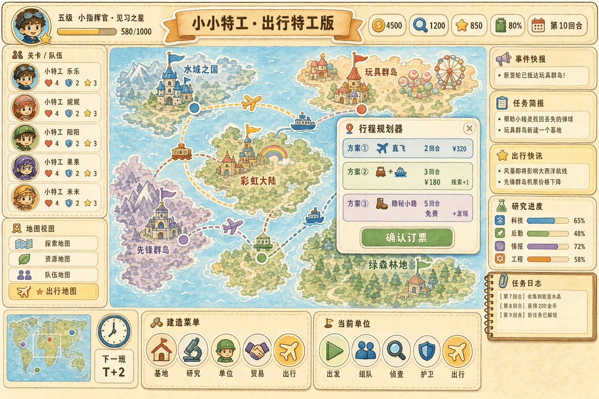

# 小小特工 · 出行特工版 (map-game)

> Agents: Global Control · Travel Edition  
> 一款轻策略 + 经营养成 + 全球探险 的家庭/儿童向回合制游戏，在原作《小小特工》框架上 **叠加"出行"为核心玩法主线**。



> 旧版线框稿见 `assets/ui-wireframe-main.png`，重设计方案详见 [docs/05-ui-redesign-gameplay.md](docs/05-ui-redesign-gameplay.md)

---

## 📌 项目定位

- **类型**：轻策略 / 经营养成 / 探索解谜 / 家庭友好
- **核心循环**：派遣特工 → ★ 行程规划 → 出行/路上事件 → 完成任务 → 收集线索 → 升级基地 → 解锁新区域
- **特色**：把"出行（多式联运 + 时刻表 + 路上事件）"从位移工具升级为独立玩法主线

## 🌍 世界观

地图被分为五块主题大陆：

| 大陆 | 主题 |
|------|------|
| Water Land | 水域之国 |
| Toy Isles | 玩具群岛 |
| Rainbow Land | 彩虹大陆 |
| Vanguard Isles | 先锋群岛 |
| Greenforest Land | 绿森林地 |

玩家作为「Little Commander」，指挥 5 人特工小队 `Team Alpha`，使用 `Coins / Clues / Stars` 三种货币，在 `Base / Research / Units / Trade / ★ Transit` 五大模块间经营。

## 🚆 出行玩法亮点

- **5 种载具**：✈ 飞机、⛴ 轮船、🚆 火车、🚚 卡车、🥾 越野
- **3 套方案**：每次行程算出「最快 / 最省 / 最稳」三套行程卡
- **时刻表 + 班次**：每回合刷新班次窗口，错过要等下一班
- **路上事件骰**：风暴 / 海盗 / 偶遇线索，每回合触发
- **6 类出行任务**：VIP 护送、轨迹追踪、走私拦截、签证通行、背包客挑战、极端天气

## 🏗️ 技术栈

| 层 | 选型 |
|---|---|
| 客户端 | Cocos Creator 3.8 + TypeScript 5（主游戏） |
| Web UI | React 19 + Vite 6 + Tailwind 4（`web/`，浏览器指挥终端） |
| 后端 | Spring Boot 3.2 + MyBatis-Plus 等（**`server/` 暂缓实现**，见下文） |
| 调度 | Quartz / XXL-Job（规划中） |
| 存储 | MySQL 8 / Redis 7（规划中） |
| 通信 | RabbitMQ + WebSocket（规划中） |
| 部署 | Docker + Kubernetes + Nginx |
| 配置 | Nacos |

> **当前阶段**：以 **`web/` 指挥终端** 与文档/原型为主；**Spring Boot 后端业务与接口落地后续再做**。`server/` 内保留脚手架与设计对齐的 SQL，便于日后接续开发。

## 📂 项目结构

```text
map-game/
├── docs/                # 设计文档（已交付）
│   ├── 01-solution-design.md
│   ├── 02-requirement-prototype.md
│   ├── 03-roadmap.md
│   ├── 04-travel-system.md
│   └── sprint/          # S1-S6 每步实现图
├── server/              # Spring Boot 3 工程（暂缓实现，保留脚手架与迁移脚本）
│   ├── pom.xml
│   ├── docker-compose.yml
│   ├── README.md        # 启动说明
│   └── src/main/java/com/mapgame/...
├── client/              # 前端 Cocos Creator 3.8 工程
│   ├── package.json
│   ├── tsconfig.json
│   ├── README.md        # 接入 Cocos 编辑器说明
│   └── assets/scripts/  # api / core / world / travel / ui
├── web/                 # ★ Web 前端（React + Vite + Tailwind）
│   ├── package.json     # workspace 名：map-game-web
│   ├── vite.config.ts   # 开发代理 /api → 后端 8080
│   └── src/             # App、API、样式
├── package.json         # 根工作区：npm run dev:web / build:web
├── deploy/
│   └── nginx-map-game-9001.conf  # Homebrew nginx 引用：HTTP 9001 + /api 反代 8080
└── web-demo/            # S4 出行 Canvas Demo（原生 HTML，可选对照）
    ├── index.html
    ├── style.css
    ├── README.md        # python -m http.server 5500
    └── js/              # data / planner / map / main
```

## 📑 文档目录

- [01 · 方案设计](docs/01-solution-design.md) — 总体架构、模块依赖、技术栈、ER 图、状态机、关键时序图
- [02 · 需求原型](docs/02-requirement-prototype.md) — 用例图、用户旅程、信息架构、UI 线框稿、需求清单
- [03 · 落地路线图](docs/03-roadmap.md) — 6 个 Sprint 的每步实现图清单（全部✅）
- [04 · 出行系统详细设计](docs/04-travel-system.md) — 多式联运、时刻表、路上事件、任务类型
- [★ 05 · UI 素材重设计 & 玩法深化](docs/05-ui-redesign-gameplay.md) — 全中文水彩贴纸风视觉规范、7 张高保真素材（`assets/ui-redesign/`）、行程规划/事件卡/疲劳/护照等交互与玩法深化
- [Server README](server/README.md) — 后端目录说明（**启动与完整 API 后续实现**）
- [Client README](client/README.md) — 前端如何接入 Cocos Creator
- [★ Web Demo README](web-demo/README.md) — 旧版 Canvas 演示（可选）
  - **`web-demo/standalone.html`** — 单文件版, **双击即开**, 无需服务器
- **Web 高保真 UI**：在仓库根执行 `npm install` 后 `npm run dev:web`，默认 <http://localhost:3000>；`/api` 代理至 `http://127.0.0.1:8080`（**后端未启动时页面会显示加载失败**，属预期）
- **本机 Nginx（9001）**：`npm run build:web` 后，`include` 见 `deploy/nginx-map-game-9001.conf`；**反代 `/api` 依赖后端就绪后**再联调；`nginx -t && nginx -s reload`

## 🗺️ 落地路线（MVP → 完整版）

| Sprint | 周期 | 交付 |
|--------|------|------|
| S1 · 骨架 | 2w | 地图渲染、节点点击、回合系统 |
| S2 · 角色 | 2w | 特工/队伍 CRUD、组队 UI |
| S3 · 任务 | 2w | 任务接取、Mission Log、资源结算 |
| **S4 · 出行 ★** | **3w** | **载具/路径/规划器/时刻表/事件骰** |
| S5 · 经营 | 2w | Base / Research / Units / Trade |
| S6 · 表现 | 2w | 动画、音效、剧情、平衡性 |

## ✅ 当前状态

- [x] 方案设计完成
- [x] 需求原型完成
- [x] UI 高保真线框稿
- [x] S1 地图骨架实现图
- [x] S2 特工/队伍实现图
- [x] S3 任务系统实现图
- [x] S4 出行系统实现图（重点）
- [x] S5 建造研究实现图
- [x] S6 事件平衡实现图
- [ ] Spring Boot 后端业务与接口（**后续实现**；`server/` 脚手架已保留）
- [x] 前端工程脚手架（Cocos Creator 3.8 + TypeScript）
- [x] S2-S6 模块全量 DDL + 种子数据 + 30 项数值平衡
- [x] S4 出行可玩 Demo 集成（Web Canvas 即开即玩）
- [x] React + Vite Web UI 纳入根 npm workspace（`web/` / `map-game-web`）
- [x] UI 素材重设计（全中文水彩风）+ 交互/玩法深化方案（`docs/05` + `assets/ui-redesign/`）

## 🤝 协作

仓库地址：https://github.com/langdexuming/map-game （私有）

---

© 2026 langdexuming. All rights reserved.
