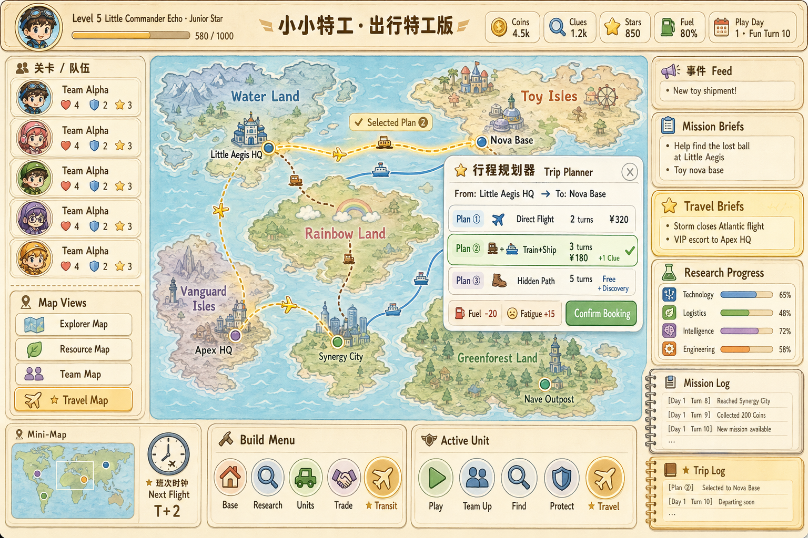

# 小小特工 · 出行特工版 (map-game)

> Agents: Global Control · Travel Edition  
> 一款轻策略 + 经营养成 + 全球探险 的家庭/儿童向回合制游戏，在原作《小小特工》框架上 **叠加"出行"为核心玩法主线**。

---

## 📌 项目定位

- **类型**：轻策略 / 经营养成 / 探索解谜 / 家庭友好
- **核心循环**：派遣特工 → ★ 行程规划 → 出行/路上事件 → 完成任务 → 收集线索 → 升级基地 → 解锁新区域
- **特色**：把"出行（多式联运 + 时刻表 + 路上事件）"从位移工具升级为独立玩法主线

## 🌍 世界观

地图被分为五块主题大陆：

| 大陆 | 主题 |
|------|------|
| Water Land | 水域之国 |
| Toy Isles | 玩具群岛 |
| Rainbow Land | 彩虹大陆 |
| Vanguard Isles | 先锋群岛 |
| Greenforest Land | 绿森林地 |

玩家作为「Little Commander」，指挥 5 人特工小队 `Team Alpha`，使用 `Coins / Clues / Stars` 三种货币，在 `Base / Research / Units / Trade / ★ Transit` 五大模块间经营。

## 🚆 出行玩法亮点

- **5 种载具**：✈ 飞机、⛴ 轮船、🚆 火车、🚚 卡车、🥾 越野
- **3 套方案**：每次行程算出「最快 / 最省 / 最稳」三套行程卡
- **时刻表 + 班次**：每回合刷新班次窗口，错过要等下一班
- **路上事件骰**：风暴 / 海盗 / 偶遇线索，每回合触发
- **6 类出行任务**：VIP 护送、轨迹追踪、走私拦截、签证通行、背包客挑战、极端天气

## 🏗️ 技术栈

| 层 | 选型 |
|---|---|
| 客户端 | Cocos Creator 3.8 + TypeScript 5 |
| 后端 | Spring Boot 3.2 + MyBatis-Plus + Lombok + Swagger3 |
| 调度 | Quartz / XXL-Job |
| 存储 | MySQL 8 / Redis 7 |
| 通信 | RabbitMQ + WebSocket |
| 部署 | Docker + Kubernetes + Nginx |
| 配置 | Nacos |

## 📂 文档目录

- [01 · 方案设计](docs/01-solution-design.md) — 总体架构、模块依赖、技术栈、ER 图、状态机、关键时序图
- [02 · 需求原型](docs/02-requirement-prototype.md) — 用例图、用户旅程、信息架构、UI 线框稿、需求清单
- [03 · 落地路线图](docs/03-roadmap.md) — 6 个 Sprint 的每步实现图清单
- [04 · 出行系统详细设计](docs/04-travel-system.md) — 多式联运、时刻表、路上事件、任务类型

## 🗺️ 落地路线（MVP → 完整版）

| Sprint | 周期 | 交付 |
|--------|------|------|
| S1 · 骨架 | 2w | 地图渲染、节点点击、回合系统 |
| S2 · 角色 | 2w | 特工/队伍 CRUD、组队 UI |
| S3 · 任务 | 2w | 任务接取、Mission Log、资源结算 |
| **S4 · 出行 ★** | **3w** | **载具/路径/规划器/时刻表/事件骰** |
| S5 · 经营 | 2w | Base / Research / Units / Trade |
| S6 · 表现 | 2w | 动画、音效、剧情、平衡性 |

## ✅ 当前状态

- [x] 方案设计完成
- [x] 需求原型完成
- [x] UI 高保真线框稿
- [x] S1 地图骨架实现图
- [x] S2 特工/队伍实现图
- [x] S3 任务系统实现图
- [ ] S4 出行系统实现图（重点）
- [ ] S5 建造研究实现图
- [ ] S6 事件平衡实现图
- [ ] 工程脚手架（前后端）

## 🤝 协作

仓库地址：https://github.com/langdexuming/map-game （私有）

---

© 2026 langdexuming. All rights reserved.
