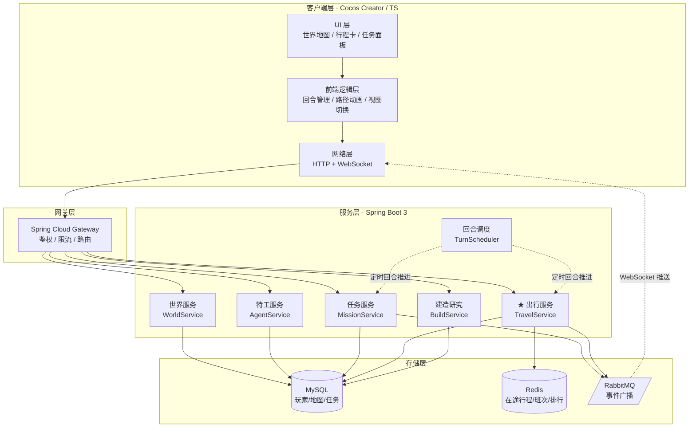
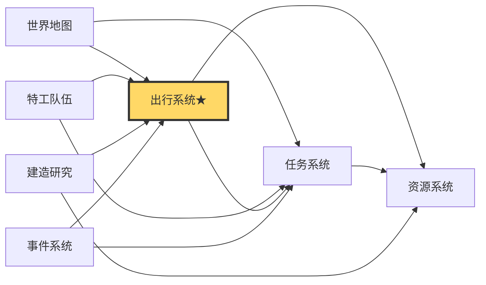
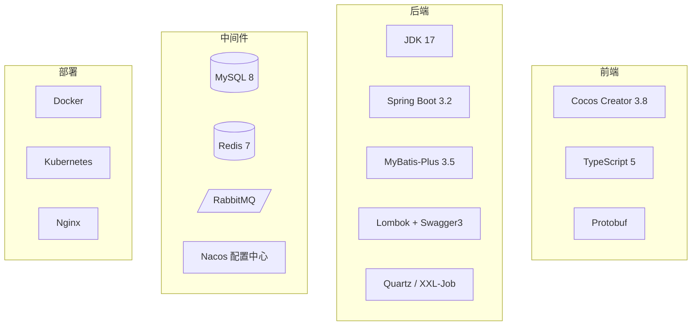
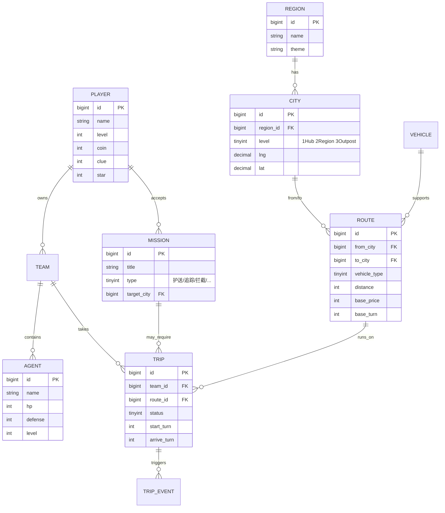
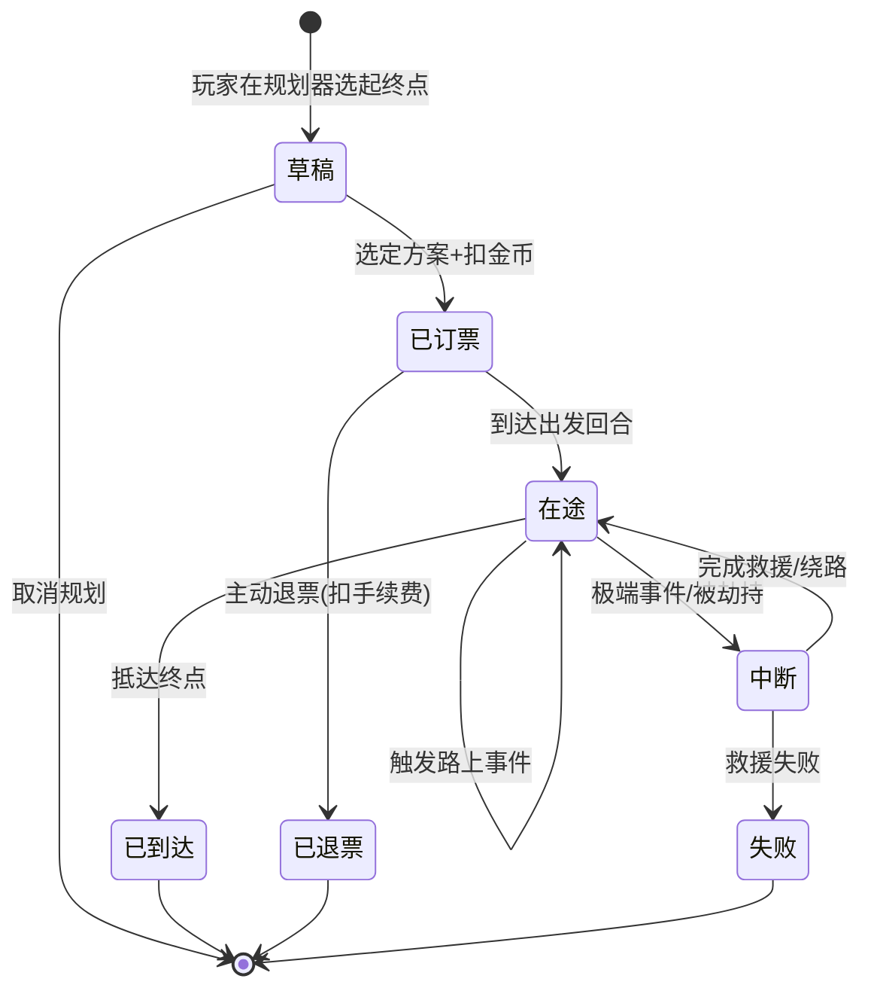
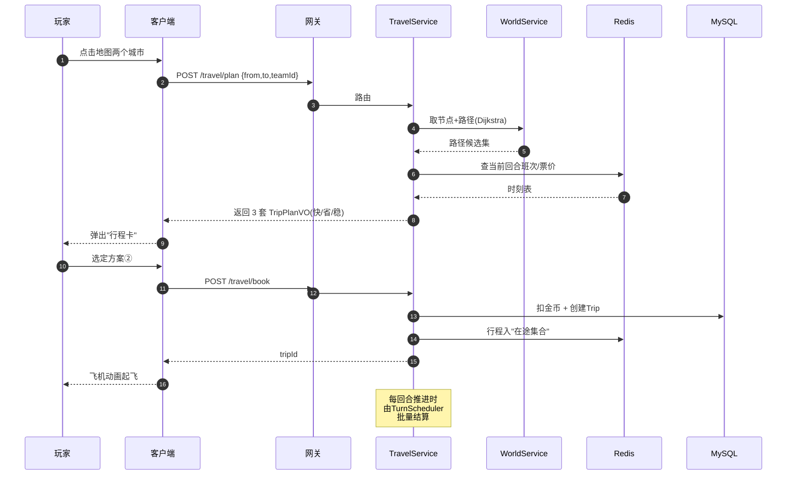

# 01 · 方案设计 (Solution Design)

> 总体架构、模块依赖、技术栈、ER 图、状态机、关键时序图。

---

## 1.1 总体分层架构

---

## 1.2 模块依赖关系

> **黄色高亮**的「出行系统」是这次叠加的核心：向上承接任务、向下消耗资源、被建造解锁、被事件干扰。

---

## 1.3 技术栈选型

---

## 1.4 领域模型 ER 图

---

## 1.5 行程状态机（Trip State Machine）

---

## 1.6 关键流程：「行程预订」时序图

---

## 1.7 后端代码规范摘要（与团队 Java 规范对齐）

- 接口参数统一使用 `XxxQuery` 实体接收，**禁止 Map**
- 接口返回统一使用 `XxxVO` 并加 `@ApiModelProperty`，**禁止 Map**
- 所有类必须有 `@author make java` + `@since 日期` 注释
- 实体类强制 Lombok `@Data`
- 日志统一 `@Slf4j`，捕获异常未抛出必须打日志
- 配置项统一在 `Configuration` 类静态字段，不在 Service 直接 `@Value`
- Redis 多 key 使用 `multiGet` 批量操作
- `if` 必须带大括号，禁止行尾注释
