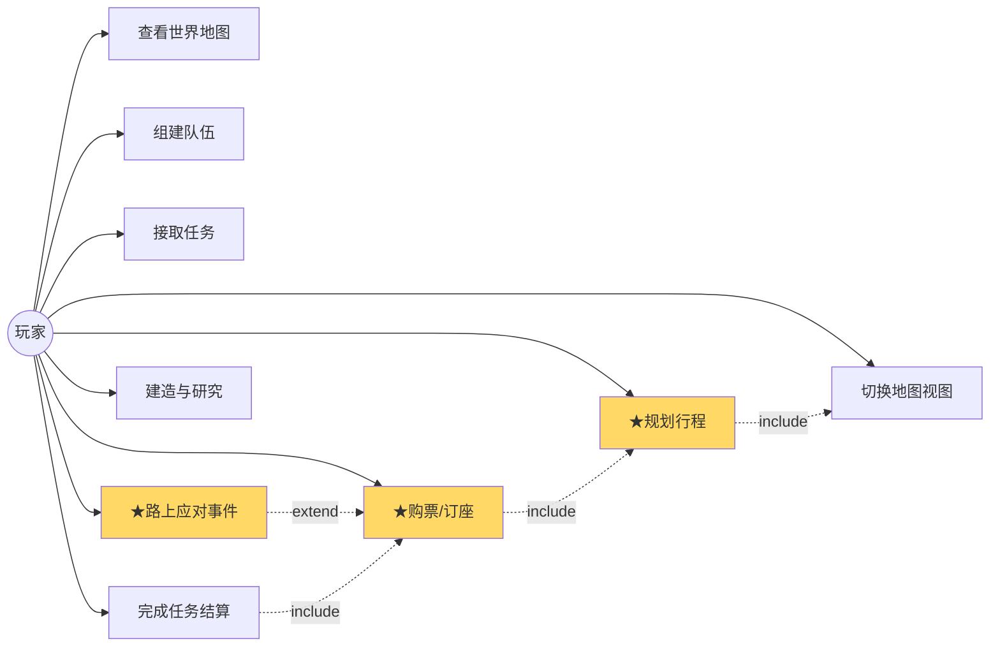
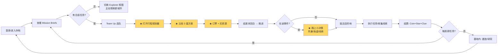
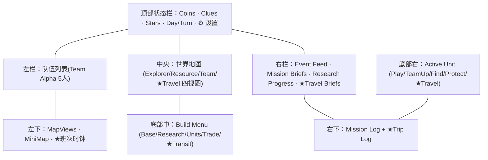
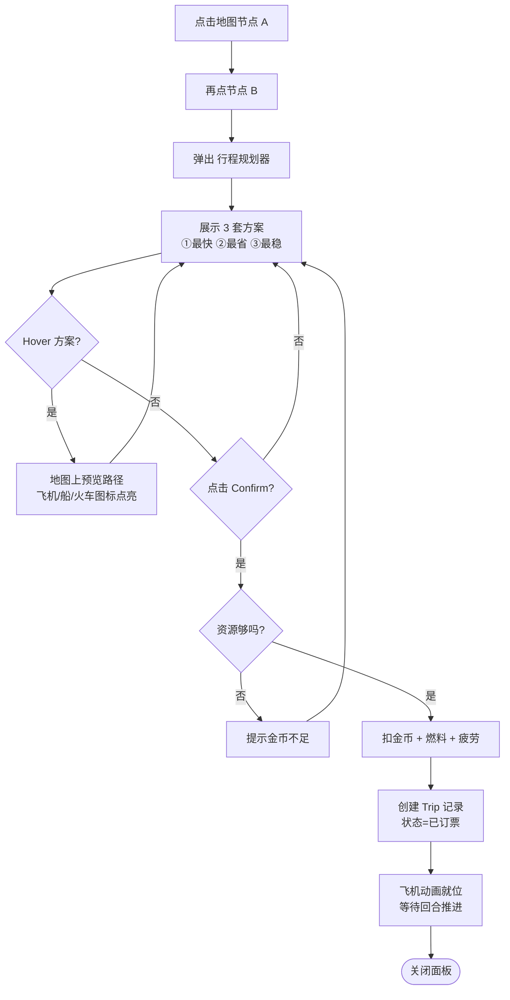

# 02 · 需求原型 (Requirement Prototype)

> 用例图、用户旅程、信息架构、UI 线框稿、需求清单。

---

## 2.1 用例图（玩家视角）

---

## 2.2 玩家核心循环（User Journey）

---

## 2.3 主界面信息架构

---

## 2.4 UI 高保真线框稿

**关键变更点（对比原作）**：

1. 左栏 Map Views **新增第 4 个 ★ Travel Map**（金色高亮）
2. 右栏 **新增 ★ Travel Briefs** 面板，与 Mission Briefs 平级
3. 左下 MiniMap 旁 **新增"班次时钟" Next Flight T+2**
4. 底部 Build Menu **新增第 5 颗按钮 ★ Transit**
5. 底部 Active Unit **新增第 5 颗按钮 ★ Travel**
6. 右下 **新增 ★ Trip Log** 行程历史
7. 顶部 **新增 Fuel 燃料**资源状态（出行核心限制）
8. 地图上 **3 类路径线**：黄虚线（飞机）/ 蓝实线（轮船）/ 棕点线（火车）

---

## 2.5 行程规划器面板（细节交互）

---

## 2.6 功能需求清单（验收标准）

| 编号 | 需求 | 优先级 | 验收标准 |
|------|------|--------|----------|
| FR-01 | 任意两节点间能算出 ≥1 条路径 | P0 | Dijkstra 单测覆盖 |
| FR-02 | 行程规划器返回 3 种偏好方案 | P0 | 快/省/稳各 1 套 |
| FR-03 | 订票扣 Coin/Fuel/Fatigue | P0 | 余额校验 + 事务回滚 |
| FR-04 | 在途回合掷事件骰 | P1 | 概率配置可调 |
| FR-05 | 极端天气可关闭航线 | P1 | 标记 Route.disabled |
| FR-06 | VIP 护送任务串联 Trip | P1 | 任务挂 trip_id |
| FR-07 | 班次时刻表按回合刷新 | P2 | Quartz 5 分钟级 |
| FR-08 | Travel Map 视图独立高亮 | P0 | 4 视图切换 ≤200ms |
| FR-09 | Trip Log 历史记录 | P2 | 30 天保留 |
| FR-10 | 退票/改签 | P2 | 手续费 30% |

---

## 2.7 非功能需求

| 类别 | 指标 |
|------|------|
| 响应时间 | 行程规划 ≤ 500ms、地图视图切换 ≤ 200ms |
| 并发 | 单服支持 ≥ 1000 在线玩家 |
| 可用性 | 99.5% |
| 数据一致性 | 订票走分布式事务（Seata 或本地消息表） |
| 可玩性 | 单局 30 分钟内可推进 ≥ 3 个任务 |
| 适龄 | 6+ 岁，无暴力血腥 |
