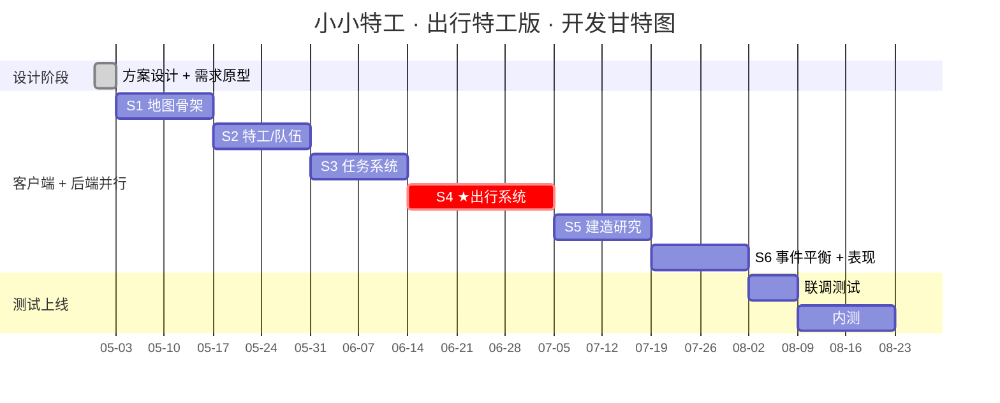
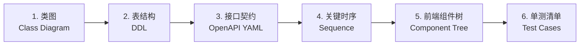

# 03 · 落地路线图 (Roadmap)

> 6 个 Sprint 的每步实现图清单，每个 Sprint 后续会补足"实现图"详细文档。

---

## 3.1 总览

---

## 3.2 每步实现图清单

| Sprint | 实现图内容 | 文档 | 状态 |
|--------|-----------|------|------|
| **S1** | 地图骨架实现图：Cocos 场景树 + 节点渲染流程 + 后端 World API 时序 | [docs/sprint/s1-map-skeleton.md](sprint/s1-map-skeleton.md) | ✅ 已交付 |
| **S2** | 特工/队伍实现图：类图 + Team 组件 UI + 后端 Agent CRUD 时序 | [docs/sprint/s2-agent-team.md](sprint/s2-agent-team.md) | ✅ 已交付 |
| **S3** | 任务系统实现图：任务状态机 + Mission 类图 + 接取/结算时序 | [docs/sprint/s3-mission.md](sprint/s3-mission.md) | ✅ 已交付 |
| **S4 ★** | 出行系统实现图：Dijkstra 流程 + Trip 完整生命周期 + 路上事件流程 + 三视图切换 | [docs/sprint/s4-travel.md](sprint/s4-travel.md) | ✅ 已交付 |
| **S5** | 建造研究实现图：科技树数据结构 + 建造成本 + 解锁规则 | [docs/sprint/s5-build-research.md](sprint/s5-build-research.md) | ✅ 已交付 |
| **S6** | 事件/平衡实现图：事件触发 DSL + 数值平衡表 | docs/sprint/s6-event-balance.md | ⬜ 待画 |

---

## 3.3 风险清单

| 风险 | 等级 | 应对 |
|------|------|------|
| 出行系统玩法过深，儿童难上手 | 高 | 先 MVP 用 2 种载具+1 套方案，逐步扩 |
| 路径算法在大地图性能 | 中 | 提前缓存所有 Hub-Hub 最短路 |
| 美术资源（5 类载具动画）成本高 | 中 | 第一版用 sprite 图标静态展示 |
| 平衡性数据手调难 | 中 | 数值用 Excel + 后端热加载 |
| 儿童端合规（实名/防沉迷） | 高 | 使用单机存档优先，联网功能后置 |

---

## 3.4 每个 Sprint 的「实现图」会包含什么

每个 sprint 的实现图文档会按以下模板出图，确保从设计到代码都能对齐：

> 你确认这个模板后，S1 实现图就按这 6 块来画。
