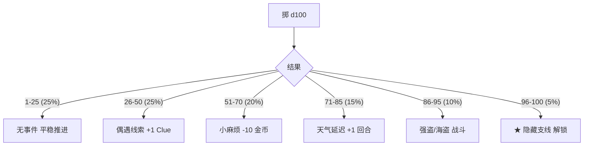

# 04 · 出行系统详细设计 (Travel System)

> 本项目的核心叠加模块。多式联运、时刻表、行程规划器、路上事件、出行任务。

---

## 4.1 五种载具一览

| 载具 | 速度 | 载量 | 票价 | 适用 | 特殊 |
|------|------|------|------|------|------|
| ✈ 飞机 | 快 | 小 | 高 | 跨大陆 Hub→Hub | 怕风暴 |
| ⛴ 轮船 | 慢 | 大 | 低 | 沿海/跨洋 | 可载车 |
| 🚆 火车 | 中 | 中 | 中 | 同大陆城市 | 准点率高 |
| 🚚 卡车 | 中 | 中 | 中 | 公路网 | 偏远可达 |
| 🥾 越野/步行 | 慢 | 极小 | 0 | 无路区 | 可发现隐藏点 |

---

## 4.2 城市分级 + 枢纽

| 等级 | 名称 | 配置 | 出现频率 |
|------|------|------|----------|
| 1 | 国际枢纽 Hub | 机场 + 海港 + 火车 | 5~8 个 / 全图 |
| 2 | 区域城市 Region | 火车 + 卡车 | 20~30 个 |
| 3 | 据点 Outpost | 仅卡车/越野 | 30+ 个 |

每个节点提供 5 件套：**补给 / 维修 / 招募 / 住宿 / 酒馆情报**

---

## 4.3 行程规划器（核心交互）

```text
┌────────── 行程规划 Trip Planner ──────────┐
│ Little Aegis HQ ─► Nova Base               │
│                                            │
│ 推荐方案：                                 │
│  ① ✈ 直飞   2 回合  ¥320                   │
│  ② 🚆+⛴   3 回合  ¥180  ★线索+1            │
│  ③ 🥾隐路  5 回合  ¥0   ★发现率++          │
│                                            │
│ 燃料：120/200    队伍疲劳：+15             │
│                                            │
│           [取消]    [✓ 确认订票]           │
└────────────────────────────────────────────┘
```

**机制点**：
- 不同方案 = 时间 / 金钱 / 风险 / 收益的 4 维权衡
- 选定后，特工按回合在路上推进
- 路上每回合 25% 概率掷一次「事件骰」

---

## 4.4 时刻表 + 票务

```mermaid
gantt
    title 班次窗口示例（飞机航线 LittleAegis-Nova）
    dateFormat X
    axisFormat T+%s

    section 周期
    第 1 班   :done, t1, 0, 1
    第 2 班   :done, t2, 3, 1
    第 3 班   :active, t3, 6, 1
    第 4 班   :t4, 9, 1
```



- 每 3 回合一个班次窗口
- 提前 ≥1 回合预订打 8 折
- 临时起飞 +50% 加价
- 旺季（剧情节点）票价 ×1.3
- 改签手续费 30%、退票手续费 30%

---

## 4.5 路上事件骰（每回合）



事件配置由 `event-config.yml` 在 Configuration 类统一加载，可热刷新调整概率。

---

## 4.6 出行专属任务类型

| 任务 | 玩法 | 失败惩罚 | 关联系统 |
|------|------|----------|----------|
| 🛡 VIP 护送 | 沿规划路线送达 | VIP 阵亡 / 失分 | Trip + Mission |
| 🔍 轨迹追踪 | 根据订票记录倒推位置 | 错过抓捕 | Trip 历史 |
| 📦 走私拦截 | 港口/机场截获货物 | 走私品扩散 | Vehicle Inspector |
| 🪪 签证/通行证 | 解锁新区域出行权 | 进不去 | Region 解锁 |
| 🎒 背包客挑战 | 限定预算环游 | 资源掉光 | Trip + Resource |
| 🌪 极端天气 | 风暴关航线，临时改路 | 行程拖延 | Event + Route |

---

## 4.7 关键 API 草案（Java）

> 严格遵循团队 Java 规范：`XxxQuery` / `XxxVO` / Lombok / Swagger / @Slf4j / Configuration

### 4.7.1 实体

```java
/**
 * 出行行程实体
 * @author make java
 * @since 2026-04-30
 */
@Data
@TableName("trip")
public class Trip {

    @ApiModelProperty("行程ID")
    private Long id;

    @ApiModelProperty("队伍ID")
    private Long teamId;

    @ApiModelProperty("路径ID")
    private Long routeId;

    @ApiModelProperty("状态: 0未出发 1在途 2到达 3取消")
    private Integer status;

    @ApiModelProperty("出发回合")
    private Integer startTurn;

    @ApiModelProperty("到达回合")
    private Integer arriveTurn;

    @ApiModelProperty("已支付金币")
    private Integer paidCoin;
}
```

### 4.7.2 Query / VO

```java
/**
 * 行程规划查询参数
 * @author make java
 * @since 2026-04-30
 */
@Data
public class TripPlanQuery {

    @ApiModelProperty(value = "起点城市ID", required = true)
    private Long fromCityId;

    @ApiModelProperty(value = "终点城市ID", required = true)
    private Long toCityId;

    @ApiModelProperty("队伍ID")
    private Long teamId;

    @ApiModelProperty("偏好: 1最快 2最省 3最低风险")
    private Integer preference;
}

/**
 * 行程方案返回VO
 * @author make java
 * @since 2026-04-30
 */
@Data
public class TripPlanVO {

    @ApiModelProperty("方案编号")
    private Integer planNo;

    @ApiModelProperty("载具链路, 如 [PLANE,SHIP]")
    private List<String> vehicleChain;

    @ApiModelProperty("总耗时(回合)")
    private Integer totalTurn;

    @ApiModelProperty("总票价")
    private Integer totalPrice;

    @ApiModelProperty("路上事件期望: 0-3")
    private Integer eventExpect;

    @ApiModelProperty("额外收益描述")
    private String bonusDesc;
}
```

### 4.7.3 Service 接口

```java
/**
 * 出行服务接口
 * @author make java
 * @since 2026-04-30
 */
public interface TravelService {

    /**
     * 计算多套行程方案（最快/最省/最稳）
     * @param query 起终点+偏好
     * @return 方案列表
     */
    List<TripPlanVO> planTrip(TripPlanQuery query);

    /**
     * 提交行程（订票+扣资源+创建Trip）
     * @param query 行程提交参数
     * @return 行程ID
     */
    Long bookTrip(TripBookQuery query);

    /**
     * 回合推进时结算所有在途行程
     * @param currentTurn 当前回合
     */
    void advanceTrips(Integer currentTurn);
}
```

### 4.7.4 Configuration 统一管理

```java
/**
 * 出行模块配置
 * @author make java
 * @since 2026-04-30
 */
@Component
public class Configuration {

    /** 飞机基础票价系数 */
    public static Double PLANE_PRICE_FACTOR;

    /** 在途事件触发概率 */
    public static Double TRIP_EVENT_RATE;

    /** 旺季加价倍数 */
    public static Double PEAK_PRICE_RATE;

    @Value("${travel.plane.price-factor:1.5}")
    public void setPlanePriceFactor(Double v) {
        PLANE_PRICE_FACTOR = v;
    }

    @Value("${travel.trip.event-rate:0.25}")
    public void setTripEventRate(Double v) {
        TRIP_EVENT_RATE = v;
    }

    @Value("${travel.peak.price-rate:1.3}")
    public void setPeakPriceRate(Double v) {
        PEAK_PRICE_RATE = v;
    }
}
```

---

## 4.8 关键表 DDL（草案）

```sql
-- 节点
CREATE TABLE city (
  id BIGINT PRIMARY KEY,
  region_id BIGINT,
  name VARCHAR(64),
  level TINYINT COMMENT '1-Hub 2-Region 3-Outpost',
  lng DECIMAL(9,6), lat DECIMAL(8,6)
);

-- 路径
CREATE TABLE route (
  id BIGINT PRIMARY KEY,
  from_city BIGINT,
  to_city BIGINT,
  vehicle_type TINYINT COMMENT '1-Plane 2-Ship 3-Train 4-Truck 5-Foot',
  distance INT,
  base_price INT,
  base_turn INT,
  disabled TINYINT DEFAULT 0
);

-- 行程
CREATE TABLE trip (
  id BIGINT PRIMARY KEY,
  team_id BIGINT,
  route_id BIGINT,
  status TINYINT COMMENT '0-未出发 1-在途 2-到达 3-取消',
  start_turn INT,
  arrive_turn INT,
  paid_coin INT
);

-- 行程上发生的事件流水
CREATE TABLE trip_event (
  id BIGINT PRIMARY KEY,
  trip_id BIGINT,
  event_code VARCHAR(32),
  happened_turn INT,
  payload JSON
);
```
