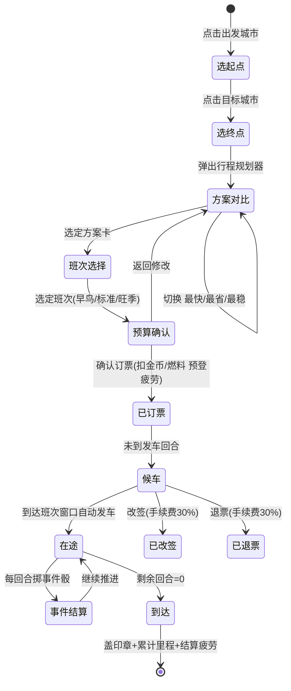
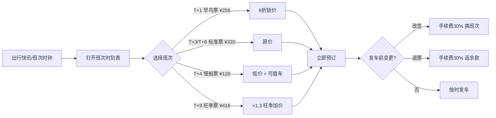
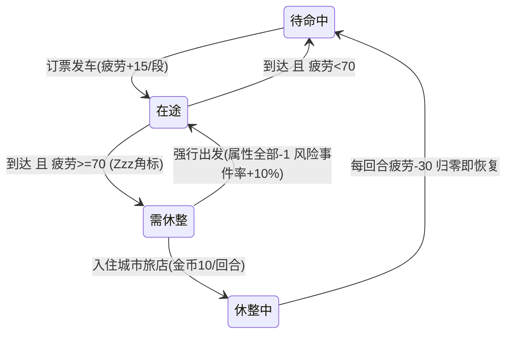
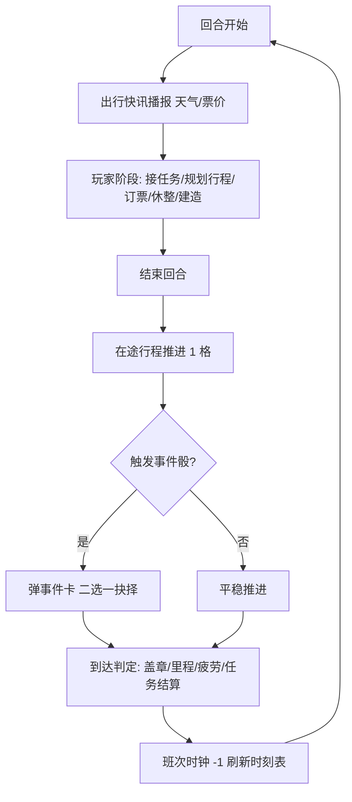

# 05 · UI 素材重设计 & 交互逻辑与玩法深化方案

> 基于主界面线框稿（`assets/ui-wireframe-main.png`）的一次整体视觉升级与玩法深化。
> 本文档只交付 **UI 素材 + 方案设计**，不含代码实现；所有界面文案统一为简体中文。

---

## 5.1 设计目标

| 维度 | 现状 | 重设计目标 |
|------|------|-----------|
| 视觉语言 | 线框稿中英文混排、信息密度高 | 全中文化、儿童绘本水彩贴纸风、信息分层 |
| 行程规划 | 三方案静态列表 | 方案卡片化 + 班次时刻轴 + 预算结算条，一屏完成决策 |
| 路上事件 | 纯随机骰、玩家被动接受 | 升级为「事件卡 + 二选一抉择」，把随机变成决策 |
| 特工养成 | 仅属性数值 | 引入疲劳条与状态徽章，出行与养成互相牵制 |
| 长线目标 | 缺少收集驱动 | 新增「特工护照」：印章 / 签证 / 里程三层收集 |

---

## 5.2 视觉规范

### 5.2.1 色板

| 角色 | 色值 | 用途 |
|------|------|------|
| 羊皮纸米黄 | `#F6EBD2` | 全局底色、面板底 |
| 暖棕描边 | `#8C6239` | 卡片描边、分隔线、正文标题 |
| 水域蓝 | `#7EC3E0` | 水面、轮船线、信息标签 |
| 嫩芽绿 | `#9CCB6B` | 确认按钮、成功态、早鸟票 |
| 珊瑚橙 | `#F08A4B` | 主操作按钮、警示丝带、旺季标记 |
| 柠檬黄 | `#F5D04C` | 星星、高亮描边、选中态 |
| 警示红 | `#D9534F` | 扣费、延误、风险文案 |

### 5.2.2 组件样式

- **面板**：圆角羊皮纸卡片（圆角 ≥ 24px），暖棕 3px 手绘抖动描边，淡投影。
- **标题**：丝带横幅（蓝/绿/橙三色按模块区分：出行=蓝、任务=绿、警示=橙）。
- **按钮**：胶囊形，三态（常态 / 按下下沉 2px / 置灰），主按钮绿色、次按钮灰色、警示按钮橙色。
- **标签**：圆角小胶囊，图标 + 简体中文短词（≤ 6 字）。
- **进度条**：圆角槽 + 渐变填充；疲劳条按区间变色（绿 0–39 / 黄 40–69 / 橙红 70–100）。
- **文字**：圆体类中文字体（如「站酷快乐体 / 思源圆体」），正文 ≥ 24px（@2x），儿童可读性优先。

### 5.2.3 图标风格

圆形水彩贴纸：白底圆票 + 暖棕描边 + 主体插画 + 淡投影，统一 1:1 画幅，导出 128px/64px 双档。
既有可复用图标见 `web/public/generated/`（金币 / 线索 / 星星 / 燃料 / 载具 / Pin / 丝带等 27 件）。

---

## 5.3 本次交付素材清单（`assets/ui-redesign/`）

| # | 文件 | 内容 | 对应界面 |
|---|------|------|----------|
| 1 | `ui-main-redesign.png` | 主界面整体重设计高保真图（全中文） | 主指挥地图 |
| 2 | `panel-trip-planner.png` | 行程规划器弹窗（方案卡 + 班次时刻轴 + 预算结算条） | 出行核心交互 |
| 3 | `panel-timetable.png` | 班次时刻表票务面板（早鸟 / 标准 / 慢船 / 旺季） | 票务子界面 |
| 4 | `cards-road-events.png` | 路上事件卡 ×3（风暴来袭 / 海盗拦截 / 偶遇线索） | 在途事件弹卡 |
| 5 | `card-agent-states.png` | 特工卡片双状态（待命中 ⇄ 在途+疲劳） | 队伍栏 / 详情 |
| 6 | `panel-passport-book.png` | 特工护照收集册（印章 / 签证 / 里程） | 新增收集界面 |
| 7 | `cards-mission-brief.png` | 出行任务简报卡 ×2（VIP 护送 / 极端天气） | 任务简报 |

### 主界面信息架构（对照线框稿的调整点）

```text
┌ 顶部 HUD ──────────────────────────────────────────┐
│ 队长头像+等级条 │ 丝带标题 │ 金币/线索/星星/燃料/回合 │
├ 左栏 ──────┬ 中央 ─────────────────┬ 右栏 ─────────┤
│ 队伍5卡    │ 水彩世界地图           │ 事件快报       │
│ (新增疲劳) │ 五大陆全中文命名       │ 任务简报       │
│ 地图视图   │ 航线+载具贴纸          │ 出行快讯(新增) │
│ 出行地图★ │ 行程规划器悬浮面板     │ 研究进度       │
│            │                        │ 任务日志       │
├ 底部 ──────┴────────────────────────┴───────────────┤
│ 小地图+班次时钟 │ 建造菜单×5 │ 行动指令×5           │
└──────────────────────────────────────────────────────┘
```

调整点：

1. **全中文化**：Water Land→水域之国、Toy Isles→玩具群岛、Rainbow Land→彩虹大陆、Vanguard Isles→先锋群岛、Greenforest Land→绿森林地；Trip Planner→行程规划器；Active Unit→当前单位。
2. **右栏新增「出行快讯」**：滚动播报航线封锁、票价波动，给时刻表玩法提供信息入口。
3. **班次时钟提权**：从角落小字升级为左下常驻组件「下一班 T+2」，点击直达班次时刻表。
4. **队伍卡叠加疲劳态**：左栏特工小卡显示状态徽章（待命/在途/休整），鼠标悬停展开疲劳条。

---

## 5.4 交互逻辑深化

### 5.4.1 行程规划器：完整状态机



**面板交互细节**（对应 `panel-trip-planner.png`）：

- 三张方案卡常驻对比，角标「最快 / 最省 / 最稳」，选中卡金边 + 皇冠贴纸；
- 卡内标签即四维权衡：回合数（时间）、票价（金钱）、风险（事件期望）、彩蛋（线索 / 换乘奖励 / 发现率）；
- 班次时刻轴直接嵌入面板：T+1 节点带「早鸟 8 折」气泡，点击节点即完成班次选择；
- 底部预算结算条实时联动：燃料 −20 / 疲劳 +15 / 票价 ¥180，资源不足时对应项变红并禁用「确认订票」。

### 5.4.2 班次时刻表与票务（对应 `panel-timetable.png`）



- 票价三规则在面板内贴士化呈现：**提前 1 回合预订享 8 折 / 临时起飞 +50% / 改签退票手续费 30%**；
- 旺季班次带红色火苗角标，与剧情节点（节日活动）联动；
- 错过班次不惩罚金币，仅自动顺延至下一班并提示「已为你改至 T+X」。

### 5.4.3 路上事件：从「随机骰」升级为「事件卡抉择」

保留 `04-travel-system.md` 的 d100 概率表，但每个非空事件**落地为一张事件卡 + 二选一按钮**（对应 `cards-road-events.png`），把随机性转化为玩家决策：

| 事件卡 | 选项 A | 选项 B | 设计意图 |
|--------|--------|--------|----------|
| 风暴来袭 | 等待放晴（延误 +1 回合） | 改走海路（换载具，票差额自付） | 时间 vs 金钱 |
| 海盗拦截 | 迎战（按护卫值判定，胜 +30 金币） | 绕路（−¥50，必定安全） | 风险 vs 稳健 |
| 偶遇线索 | 收下！（线索 +1，可能解锁支线） | — 单按钮，纯奖励 | 正反馈节拍器 |

交互节拍：在途回合结算 → 若触发事件则**暂停推进**弹卡 → 玩家 10 秒内选择（超时默认稳健项）→ 飘字结算 → 写入任务日志。
事件骰角标常驻卡片左上角，长按可查看本次 d100 掷骰结果，保证「可感知的公平」。

### 5.4.4 特工状态流转（对应 `card-agent-states.png`）



- 卡面新增**疲劳条**（绿→黄→橙红三段变色）与**状态徽章**（待命中 / 在途·还需 N 回合 / 需休整 Zzz）；
- 在途卡片头像旁追加当前载具小贴纸，让左栏一眼读懂「谁在哪、坐什么、还要几回合」。

---

## 5.5 玩法深化

### 5.5.1 疲劳 / 休整系统（新增）

| 规则 | 数值草案 |
|------|----------|
| 每段行程疲劳 | 飞机 +15 / 火车 +10 / 轮船 +8 / 卡车 +12 / 越野 +20 |
| 阈值 | <40 无影响；40–69 机敏 −1；≥70 必须休整或强行出发（全属性 −1） |
| 休整 | 城市旅店 10 金币/回合，每回合 −30 疲劳；总部休整免费 |
| 联动 | 行程规划器预算条预显「疲劳 +X」，鼓励玩家在多段联运中插入住宿节点 |

设计意图：给「最快方案刷图」加一道软约束，让慢船 / 火车等低疲劳载具拥有长线价值。

### 5.5.2 特工护照：印章 · 签证 · 里程（新增，对应 `panel-passport-book.png`）

三层收集驱动：

1. **大陆印章**：首次抵达某大陆任意 Hub 自动盖章（水域之国 / 玩具群岛 / 彩虹大陆 / 先锋群岛 / 绿森林地）；
2. **签证解锁**：先锋群岛签证 = 线索 ×30，绿森林地签证 = 星星 ×200；签证是区域旅行权（对应 4.6 签证任务）；
3. **飞行里程**：每段行程按距离累计里程，满 2000 兑换「金色涂装」等纯外观奖励；**环球通票**（集齐 5 枚印章）解锁全图班次 9 折被动。

护照册入口放在队长头像点击后弹出，作为玩家的「成长相册」。

### 5.5.3 换乘 Combo（深化联运）

- 单次行程中使用 ≥2 种载具，则结算时获得「换乘奖励」标签：线索 +1；
- 使用 ≥3 种载具达成「铁海空三连」：额外星星 +10 与限定印章 ×1；
- 在规划器方案卡上直接预告（方案② 的「换乘奖励」标签），引导玩家主动选联运而非无脑直飞。

### 5.5.4 天气与航线封锁（深化事件）

- 每 5 回合刷新一次全图天气：风暴会**关闭整条航线 2–3 回合**，受影响航线在地图上变灰 + 乌云贴纸；
- 「出行快讯」提前 1 回合预告（如「风暴即将影响大西洋航线」），给玩家留出改签窗口；
- 极端天气任务卡（`cards-mission-brief.png` 右卡）即此机制的任务化：限时改道、按时到达得「线索 +2 / 印章 ×1」。

### 5.5.5 出行任务卡牌化（对应 `cards-mission-brief.png`）

6 类出行任务（4.6 节）全部按统一卡面模板呈现：

```text
[星级角标] + [丝带任务名] + [情境插画]
路线：A → B
要求：约束条件（回合数 / 不可战败 / 改道…）
奖励：星星 / 金币 / 线索 / 印章
[进度条 或 倒计时警示条]
[主按钮：查看路线 / 重新规划]
```

任务卡与行程规划器双向跳转：点「查看路线」高亮地图路径；规划器订票时若覆盖任务路线，卡片进度自动推进。

### 5.5.6 回合节拍总览（整合后的核心循环）



---

## 5.6 落地切图与适配规范

| 项 | 规范 |
|----|------|
| 设计稿基准 | 1536×1024（横屏），安全区四边内缩 32px |
| 导出倍率 | @1x / @2x 双档，PNG-24 + 透明通道 |
| 面板九宫格 | 羊皮纸卡片按 48px 边距九宫格拉伸，丝带标题独立切图覆盖 |
| 命名规范 | `ui-` 整界面 / `panel-` 弹窗 / `cards-` 卡牌组 / `card-` 单卡 / `iconset-` 图标集，全小写中划线 |
| 字体回退 | 思源圆体 → 苹方 → 系统默认；卡面数字使用等宽数字特性 |
| 体积预算 | 单图 ≤ 1.2MB（pngquant 70–92 质量压缩），全包 ≤ 8MB |

### 后续待补素材（TODO）

| 素材 | 说明 | 备注 |
|------|------|------|
| `iconset-vehicles-resources.png` | 13 枚圆形贴纸图标总表（5 载具 + 8 资源状态） | 可先复用 `web/public/generated/` 既有 icon-*/veh-* 过渡 |
| `bar-bottom-actions.png` | 底部操作栏独立切图（建造菜单 + 行动指令 + 班次时钟） | 主界面图中已含完整样式，可先整图切片过渡 |
| 事件卡补充 | 小麻烦 / 天气延迟 / 隐藏支线 3 张 | 沿用 `cards-road-events.png` 卡面模板 |
| 五大陆地图底图（中文版） | 替换 `map-backdrop-*.png` 英文版 | 风格对齐 `ui-main-redesign.png` 中央地图 |

---

## 5.7 与既有文档的关系

- `04-travel-system.md`：本方案不改动其数值与 API 草案，仅在 4.3 / 4.4 / 4.5 之上补充 UI 表现层与交互细节；疲劳、护照、换乘 Combo 为**新增系统**，后续需补充对应 DDL（`agent_fatigue` 字段、`passport_stamp` / `mileage_log` 表）与 `XxxQuery` / `XxxVO` 接口设计。
- `02-requirement-prototype.md`：5.3 节信息架构调整替代原线框稿作为最新 UI 基准。
- `web/`：React 指挥终端可按 5.2 视觉规范逐步替换现有样式，`public/generated` 图标继续复用。
