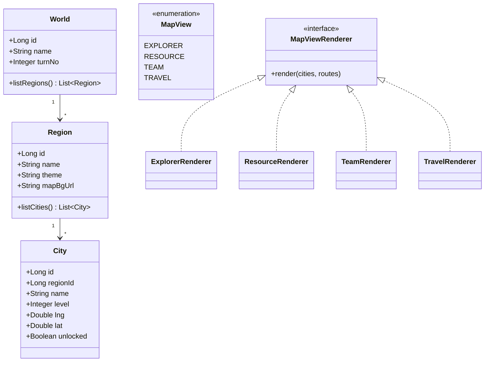
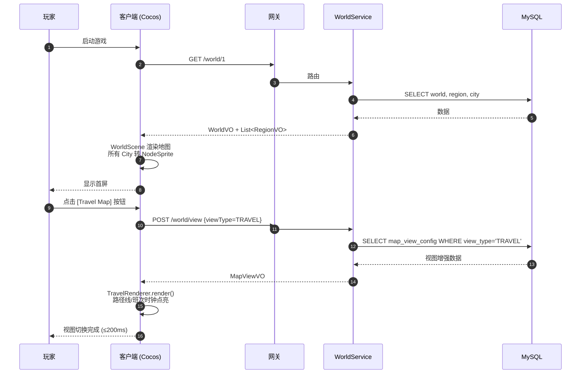
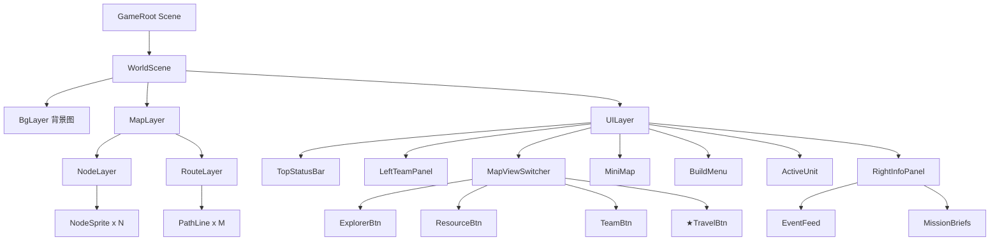

# S1 · 地图骨架实现图 (Map Skeleton)

> **目标**：跑通"打开游戏 → 看到世界地图 → 点击节点高亮 → 切换四种视图"的最小闭环。  
> **周期**：2 周。  
> **交付**：可运行的客户端首屏 + `WorldService` 完整 CRUD + 4 视图切换。

---

## 1. 类图 (Class Diagram)



---

## 2. 表结构 (DDL)

```sql
-- 世界（多存档支持）
CREATE TABLE world (
  id          BIGINT PRIMARY KEY AUTO_INCREMENT,
  name        VARCHAR(64) NOT NULL,
  turn_no     INT DEFAULT 1 COMMENT '当前回合数',
  created_at  DATETIME DEFAULT CURRENT_TIMESTAMP
) COMMENT='游戏世界/存档';

-- 大陆/区域
CREATE TABLE region (
  id          BIGINT PRIMARY KEY AUTO_INCREMENT,
  world_id    BIGINT NOT NULL,
  name        VARCHAR(64) NOT NULL COMMENT 'Water Land / Toy Isles ...',
  theme       VARCHAR(32) COMMENT '主题色/风格',
  map_bg_url  VARCHAR(255),
  INDEX idx_world (world_id)
) COMMENT='大陆区域';

-- 城市/节点
CREATE TABLE city (
  id          BIGINT PRIMARY KEY AUTO_INCREMENT,
  region_id   BIGINT NOT NULL,
  name        VARCHAR(64) NOT NULL,
  level       TINYINT DEFAULT 2 COMMENT '1-Hub 2-Region 3-Outpost',
  lng         DECIMAL(9,6) NOT NULL,
  lat         DECIMAL(8,6) NOT NULL,
  unlocked    TINYINT DEFAULT 0,
  INDEX idx_region (region_id)
) COMMENT='城市/节点';

-- 视图配置（4 种视图各自的图层数据）
CREATE TABLE map_view_config (
  id          BIGINT PRIMARY KEY AUTO_INCREMENT,
  view_type   VARCHAR(16) NOT NULL COMMENT 'EXPLORER/RESOURCE/TEAM/TRAVEL',
  city_id     BIGINT NOT NULL,
  payload     JSON COMMENT '该视图下节点的额外属性',
  UNIQUE KEY uk_view_city (view_type, city_id)
) COMMENT='地图视图扩展数据';
```

---

## 3. 接口契约 (OpenAPI 摘要)

```yaml
openapi: 3.0.3
info:
  title: World Service API
  version: 0.1.0
paths:
  /world/{worldId}:
    get:
      summary: 获取世界基础信息
      parameters:
        - name: worldId
          in: path
          required: true
          schema: { type: integer, format: int64 }
      responses:
        '200':
          description: WorldVO
          content:
            application/json:
              schema: { $ref: '#/components/schemas/WorldVO' }

  /world/{worldId}/regions:
    get:
      summary: 列出该世界全部区域+城市
      responses:
        '200':
          description: RegionVO 列表
          content:
            application/json:
              schema:
                type: array
                items: { $ref: '#/components/schemas/RegionVO' }

  /world/view:
    post:
      summary: 切换视图返回视图增强数据
      requestBody:
        required: true
        content:
          application/json:
            schema: { $ref: '#/components/schemas/MapViewQuery' }
      responses:
        '200':
          description: MapViewVO
          content:
            application/json:
              schema: { $ref: '#/components/schemas/MapViewVO' }

components:
  schemas:
    WorldVO:
      type: object
      properties:
        id: { type: integer, format: int64 }
        name: { type: string }
        turnNo: { type: integer }
    RegionVO:
      type: object
      properties:
        id: { type: integer, format: int64 }
        name: { type: string }
        theme: { type: string }
        cities:
          type: array
          items: { $ref: '#/components/schemas/CityVO' }
    CityVO:
      type: object
      properties:
        id: { type: integer, format: int64 }
        name: { type: string }
        level: { type: integer }
        lng: { type: number }
        lat: { type: number }
        unlocked: { type: boolean }
    MapViewQuery:
      type: object
      required: [worldId, viewType]
      properties:
        worldId: { type: integer, format: int64 }
        viewType:
          type: string
          enum: [EXPLORER, RESOURCE, TEAM, TRAVEL]
    MapViewVO:
      type: object
      properties:
        viewType: { type: string }
        layers:
          type: array
          items: { type: object }
```

---

## 4. 关键时序：「打开首屏 → 切换视图」



---

## 5. 前端组件树 (Cocos 场景)



**关键脚本**：

| 脚本 | 职责 |
|------|------|
| `WorldScene.ts` | 启动时拉数据、组装图层、监听视图切换事件 |
| `NodeSprite.ts` | 单个城市节点，hover 高亮、click 派发事件 |
| `MapViewSwitcher.ts` | 4 个按钮，互斥选中 |
| `MapViewRendererFactory.ts` | 根据 viewType 返回对应 Renderer |
| `WorldApi.ts` | 封装 `/world/*` HTTP 调用 |

---

## 6. 单测清单 (Test Cases)

### 后端单测

| 编号 | 用例 | 期望 |
|------|------|------|
| WS-T01 | `WorldService.getWorld(1)` 正常返回 | turnNo>=1 |
| WS-T02 | `WorldService.getWorld(99999)` 不存在 | 抛业务异常 BIZ_404 |
| WS-T03 | `WorldService.listRegionsWithCities(1)` | 返回 5 大陆 + 全部 City |
| WS-T04 | `MapViewService.getViewData(EXPLORER)` | 含全部已解锁城市 |
| WS-T05 | `MapViewService.getViewData(TRAVEL)` | 含路线 layer |

### 前端单测

| 编号 | 用例 | 期望 |
|------|------|------|
| FE-T01 | NodeSprite 点击触发 `node-click` 事件 | 监听者收到 cityId |
| FE-T02 | 切换视图按钮互斥 | 同时只有 1 个 active |
| FE-T03 | 视图切换 ≤ 200ms | performance.now 断言 |

---

## 7. 验收 Demo 场景

```text
1. 启动游戏 → 首屏出现 5 大陆 + N 个城市点
2. 鼠标 Hover 城市 → 浮出名称 tooltip
3. 点击城市 → 该城市描边高亮
4. 依次点击 4 个视图按钮 → 地图样式切换、动画 ≤ 200ms
5. 顶部状态栏显示 Day 1 · Turn 1
```

---

## 8. 与团队 Java 规范对齐核查

- [x] `MapViewQuery` 接收参数，禁止 Map
- [x] `WorldVO / RegionVO / CityVO / MapViewVO` 返回，禁止 Map
- [x] 类头注释含 `@author make java` + `@since`
- [x] 实体 Lombok `@Data`
- [x] `WorldService` 加 `@Slf4j`，异常打日志
- [x] DB 配置走 `Configuration` 静态字段
- [x] 多 city 查询走 `multiGet` Redis 缓存
