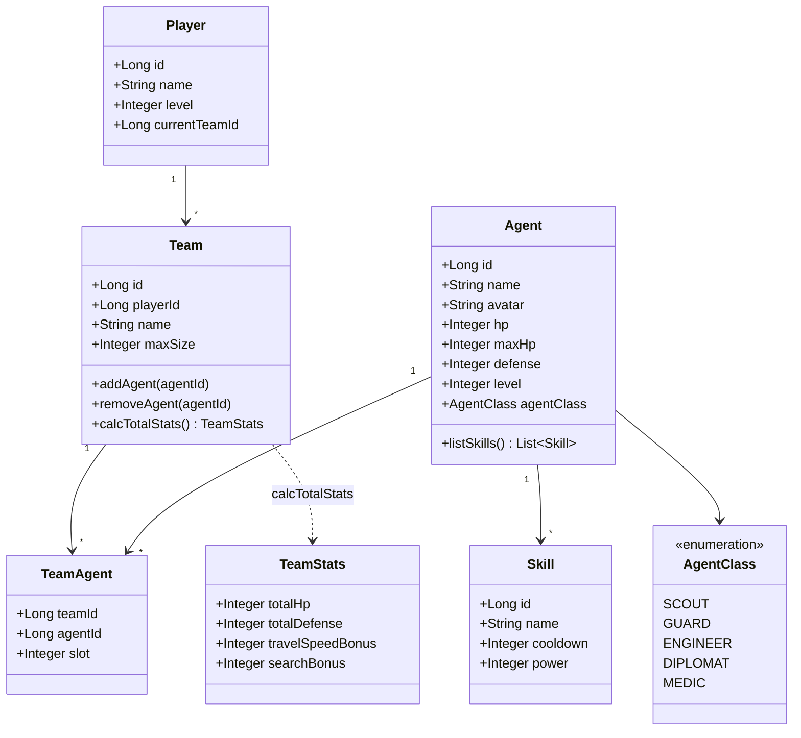
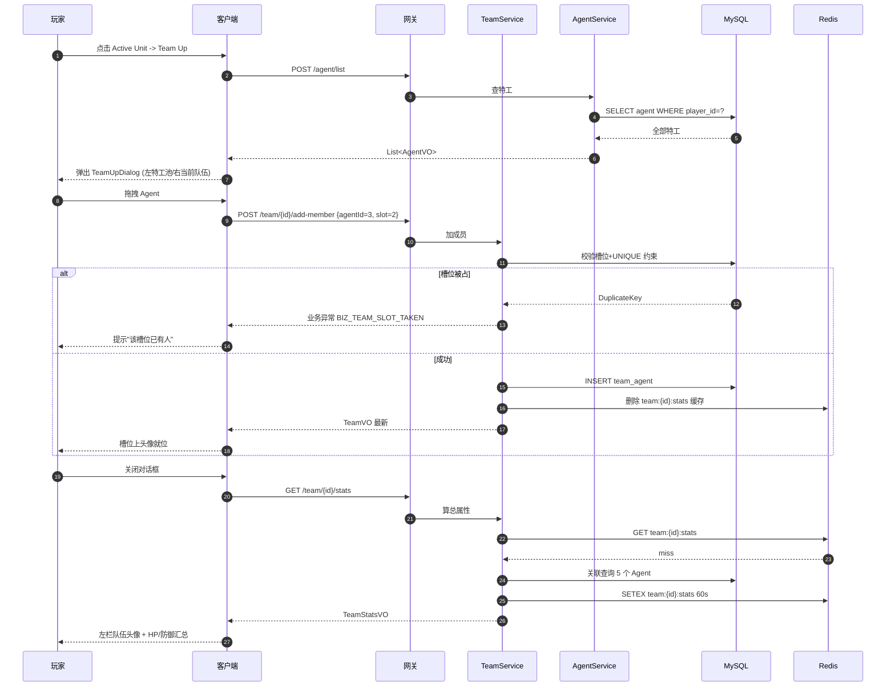
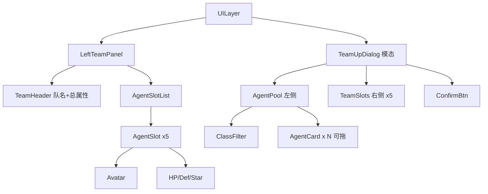

# S2 · 特工/队伍实现图 (Agent & Team)

> **目标**：玩家可以查看特工列表、组建/编辑 5 人小队、看到队伍的总属性。  
> **周期**：2 周。  
> **依赖**：S1 已完成。

---

## 1. 类图 (Class Diagram)



---

## 2. 表结构 (DDL)

```sql
-- 玩家
CREATE TABLE player (
  id              BIGINT PRIMARY KEY AUTO_INCREMENT,
  name            VARCHAR(64) NOT NULL,
  level           INT DEFAULT 1,
  current_team_id BIGINT,
  created_at      DATETIME DEFAULT CURRENT_TIMESTAMP
) COMMENT='玩家';

-- 特工
CREATE TABLE agent (
  id              BIGINT PRIMARY KEY AUTO_INCREMENT,
  player_id       BIGINT NOT NULL,
  name            VARCHAR(64) NOT NULL,
  avatar          VARCHAR(255),
  agent_class     VARCHAR(16) COMMENT 'SCOUT/GUARD/ENGINEER/DIPLOMAT/MEDIC',
  hp              INT DEFAULT 100,
  max_hp          INT DEFAULT 100,
  defense         INT DEFAULT 10,
  level           INT DEFAULT 1,
  exp             INT DEFAULT 0,
  fatigue         INT DEFAULT 0 COMMENT '疲劳值 0-100',
  INDEX idx_player (player_id)
) COMMENT='特工';

-- 队伍
CREATE TABLE team (
  id          BIGINT PRIMARY KEY AUTO_INCREMENT,
  player_id   BIGINT NOT NULL,
  name        VARCHAR(64) NOT NULL,
  max_size    TINYINT DEFAULT 5,
  INDEX idx_player (player_id)
) COMMENT='队伍';

-- 队伍-特工 关联
CREATE TABLE team_agent (
  team_id     BIGINT NOT NULL,
  agent_id    BIGINT NOT NULL,
  slot        TINYINT NOT NULL COMMENT '槽位 1-5',
  PRIMARY KEY (team_id, agent_id),
  UNIQUE KEY uk_team_slot (team_id, slot)
) COMMENT='队伍-特工关联';

-- 技能
CREATE TABLE skill (
  id          BIGINT PRIMARY KEY AUTO_INCREMENT,
  agent_id    BIGINT NOT NULL,
  name        VARCHAR(64) NOT NULL,
  cooldown    INT DEFAULT 0,
  power       INT DEFAULT 10,
  INDEX idx_agent (agent_id)
) COMMENT='技能';
```

---

## 3. 接口契约 (OpenAPI 摘要)

```yaml
paths:
  /agent/list:
    post:
      summary: 列出玩家全部特工
      requestBody:
        content:
          application/json:
            schema: { $ref: '#/components/schemas/AgentListQuery' }
      responses:
        '200':
          content:
            application/json:
              schema:
                type: array
                items: { $ref: '#/components/schemas/AgentVO' }

  /team/create:
    post:
      summary: 创建队伍
      requestBody:
        content:
          application/json:
            schema: { $ref: '#/components/schemas/TeamCreateQuery' }
      responses:
        '200':
          content:
            application/json:
              schema: { $ref: '#/components/schemas/TeamVO' }

  /team/{teamId}/add-member:
    post:
      summary: 加入特工到队伍指定槽位
      parameters:
        - name: teamId
          in: path
          required: true
          schema: { type: integer, format: int64 }
      requestBody:
        content:
          application/json:
            schema: { $ref: '#/components/schemas/TeamAddMemberQuery' }
      responses:
        '200':
          content:
            application/json:
              schema: { $ref: '#/components/schemas/TeamVO' }

  /team/{teamId}/stats:
    get:
      summary: 计算队伍总属性
      responses:
        '200':
          content:
            application/json:
              schema: { $ref: '#/components/schemas/TeamStatsVO' }

components:
  schemas:
    AgentListQuery:
      type: object
      properties:
        playerId: { type: integer, format: int64 }
        agentClass:
          type: string
          enum: [SCOUT, GUARD, ENGINEER, DIPLOMAT, MEDIC]
        minLevel: { type: integer }
    AgentVO:
      type: object
      properties:
        id: { type: integer, format: int64 }
        name: { type: string }
        avatar: { type: string }
        agentClass: { type: string }
        hp: { type: integer }
        maxHp: { type: integer }
        defense: { type: integer }
        level: { type: integer }
        fatigue: { type: integer }
    TeamCreateQuery:
      type: object
      required: [playerId, name]
      properties:
        playerId: { type: integer, format: int64 }
        name: { type: string }
        maxSize: { type: integer, default: 5 }
    TeamAddMemberQuery:
      type: object
      required: [agentId, slot]
      properties:
        agentId: { type: integer, format: int64 }
        slot: { type: integer, minimum: 1, maximum: 5 }
    TeamVO:
      type: object
      properties:
        id: { type: integer, format: int64 }
        name: { type: string }
        members:
          type: array
          items: { $ref: '#/components/schemas/AgentVO' }
    TeamStatsVO:
      type: object
      properties:
        totalHp: { type: integer }
        totalDefense: { type: integer }
        travelSpeedBonus: { type: integer }
        searchBonus: { type: integer }
```

---

## 4. 关键时序：「Team Up 组队」



---

## 5. 前端组件树



**关键脚本**：

| 脚本 | 职责 |
|------|------|
| `LeftTeamPanel.ts` | 监听 team-changed 事件，刷新左栏 |
| `AgentSlot.ts` | 单槽位，支持点击移除 / 拖入 |
| `TeamUpDialog.ts` | 弹窗主控，处理拖拽 |
| `AgentCard.ts` | 拖拽源，dragstart 事件 |
| `TeamApi.ts` / `AgentApi.ts` | HTTP 封装 |

---

## 6. 单测清单

### 后端单测

| 编号 | 用例 | 期望 |
|------|------|------|
| AT-T01 | `AgentService.list(playerId=1)` | 返回全部特工 |
| AT-T02 | `AgentService.list(class=SCOUT)` | 仅 SCOUT |
| TM-T01 | `TeamService.create()` 默认 maxSize=5 | OK |
| TM-T02 | `TeamService.addMember` 同槽位重复 | 抛 BIZ_TEAM_SLOT_TAKEN |
| TM-T03 | `TeamService.addMember` 队伍已满 | 抛 BIZ_TEAM_FULL |
| TM-T04 | `TeamService.calcStats` 缓存命中 | 不查 DB |
| TM-T05 | `TeamService.calcStats` 5 人合算 | totalHp=Σ hp |

### 前端单测

| 编号 | 用例 | 期望 |
|------|------|------|
| FE-T11 | 拖拽 AgentCard 到 Slot | 发送 add-member 请求 |
| FE-T12 | 服务端返回 BIZ_TEAM_SLOT_TAKEN | UI 弹 toast |
| FE-T13 | 队伍头像点击 -> 弹出技能小卡 | 显示技能列表 |

---

## 7. 验收 Demo

```text
1. 进入游戏 -> 左栏空队伍 5 个空槽
2. 点击 Team Up -> 弹出特工池(默认 8 个特工)
3. 按 Class 筛选 -> 只显示 SCOUT
4. 拖 3 个特工到不同槽位 -> 槽位即时显示头像
5. 关闭 -> 左栏头像/HP/防御汇总刷新
6. 重复槽位 -> 提示槽位被占
```

---

## 8. 与 Java 规范对齐

- [x] `AgentListQuery / TeamCreateQuery / TeamAddMemberQuery` 实体接收
- [x] `AgentVO / TeamVO / TeamStatsVO` 返回带 Swagger 注解
- [x] `team_agent` 表用唯一索引保证槽位互斥
- [x] `Configuration.TEAM_MAX_SIZE` 配置项
- [x] Redis `team:*:stats` 60s 缓存，team-changed 主动失效
- [x] `@Slf4j` 异常打 `log.error("Team {} 加成员失败", teamId, e)`
