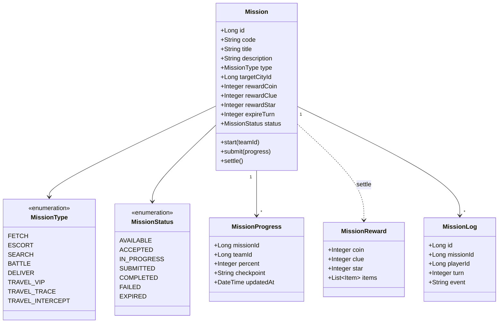
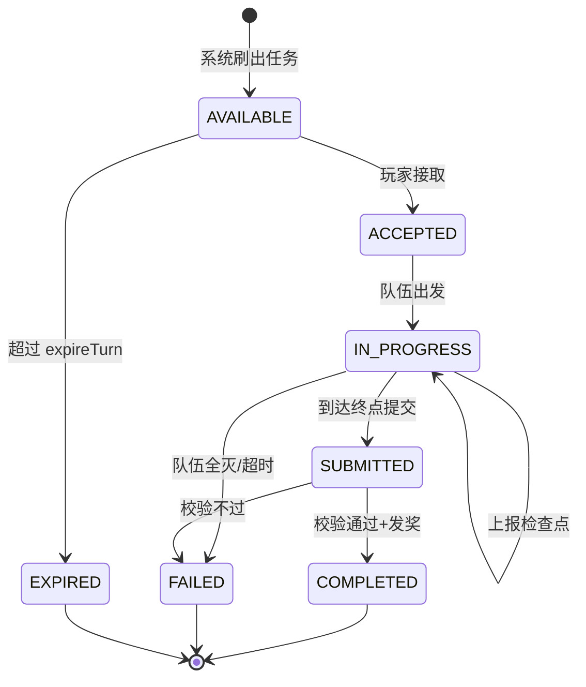
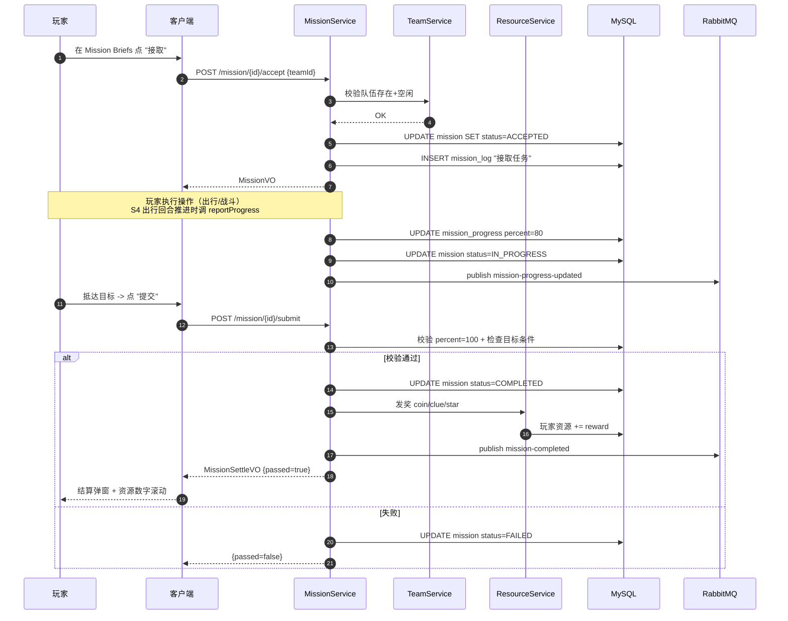
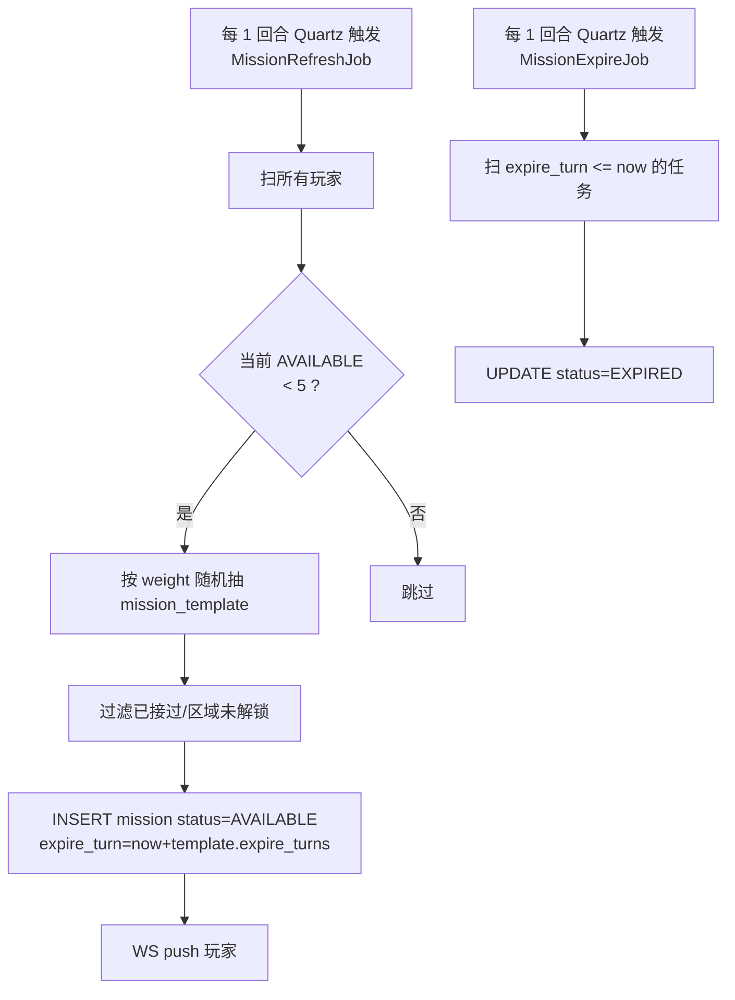
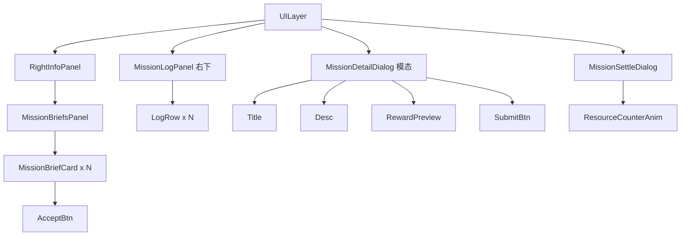

# S3 · 任务系统实现图 (Mission System)

> **目标**：玩家可以在 `Mission Briefs` 看到任务、接取后追踪、完成后结算奖励。  
> **周期**：2 周。  
> **依赖**：S1（地图节点）、S2（队伍）。

---

## 1. 类图 (Class Diagram)



---

## 2. 任务状态机



---

## 3. 表结构 (DDL)

```sql
-- 任务模板（GM 配置 / 系统刷出母版）
CREATE TABLE mission_template (
  id              BIGINT PRIMARY KEY AUTO_INCREMENT,
  code            VARCHAR(64) UNIQUE NOT NULL,
  title           VARCHAR(128) NOT NULL,
  description     TEXT,
  type            VARCHAR(32) NOT NULL COMMENT 'FETCH/ESCORT/.../TRAVEL_VIP/...',
  target_city_id  BIGINT,
  reward_coin     INT DEFAULT 0,
  reward_clue     INT DEFAULT 0,
  reward_star     INT DEFAULT 0,
  expire_turns    INT DEFAULT 10,
  weight          INT DEFAULT 100 COMMENT '权重越大越易刷出'
) COMMENT='任务模板';

-- 玩家持有的任务实例
CREATE TABLE mission (
  id              BIGINT PRIMARY KEY AUTO_INCREMENT,
  template_id     BIGINT NOT NULL,
  player_id       BIGINT NOT NULL,
  team_id         BIGINT,
  status          VARCHAR(16) NOT NULL DEFAULT 'AVAILABLE',
  accept_turn     INT,
  expire_turn     INT,
  finish_turn     INT,
  INDEX idx_player_status (player_id, status)
) COMMENT='任务实例';

-- 进度
CREATE TABLE mission_progress (
  id              BIGINT PRIMARY KEY AUTO_INCREMENT,
  mission_id      BIGINT NOT NULL,
  team_id         BIGINT NOT NULL,
  percent         INT DEFAULT 0,
  checkpoint      VARCHAR(64),
  updated_at      DATETIME DEFAULT CURRENT_TIMESTAMP,
  INDEX idx_mission (mission_id)
) COMMENT='任务进度';

-- 日志（Mission Log 显示）
CREATE TABLE mission_log (
  id              BIGINT PRIMARY KEY AUTO_INCREMENT,
  mission_id      BIGINT NOT NULL,
  player_id       BIGINT NOT NULL,
  turn            INT NOT NULL,
  event           VARCHAR(255),
  created_at      DATETIME DEFAULT CURRENT_TIMESTAMP,
  INDEX idx_player_turn (player_id, turn)
) COMMENT='任务事件日志';
```

---

## 4. 接口契约 (OpenAPI 摘要)

```yaml
paths:
  /mission/briefs:
    post:
      summary: 拉取当前可接 + 进行中任务（首页 Mission Briefs）
      requestBody:
        content:
          application/json:
            schema: { $ref: '#/components/schemas/MissionBriefsQuery' }
      responses:
        '200':
          content:
            application/json:
              schema:
                type: array
                items: { $ref: '#/components/schemas/MissionBriefVO' }

  /mission/{missionId}/accept:
    post:
      summary: 接取任务
      parameters:
        - { name: missionId, in: path, required: true, schema: { type: integer, format: int64 } }
      requestBody:
        content:
          application/json:
            schema: { $ref: '#/components/schemas/MissionAcceptQuery' }
      responses:
        '200':
          content:
            application/json:
              schema: { $ref: '#/components/schemas/MissionVO' }

  /mission/{missionId}/submit:
    post:
      summary: 提交任务
      responses:
        '200':
          content:
            application/json:
              schema: { $ref: '#/components/schemas/MissionSettleVO' }

  /mission/log:
    post:
      summary: 拉取 Mission Log 列表
      requestBody:
        content:
          application/json:
            schema: { $ref: '#/components/schemas/MissionLogQuery' }
      responses:
        '200':
          content:
            application/json:
              schema:
                type: array
                items: { $ref: '#/components/schemas/MissionLogVO' }

components:
  schemas:
    MissionBriefsQuery:
      type: object
      properties:
        playerId: { type: integer, format: int64 }
        statusIn:
          type: array
          items: { type: string, enum: [AVAILABLE, ACCEPTED, IN_PROGRESS] }
    MissionBriefVO:
      type: object
      properties:
        id: { type: integer, format: int64 }
        title: { type: string }
        type: { type: string }
        status: { type: string }
        rewardCoin: { type: integer }
        rewardStar: { type: integer }
        targetCityName: { type: string }
        expireInTurn: { type: integer }
    MissionAcceptQuery:
      type: object
      required: [teamId]
      properties:
        teamId: { type: integer, format: int64 }
    MissionVO:
      type: object
      properties:
        id: { type: integer, format: int64 }
        title: { type: string }
        status: { type: string }
        progress: { type: integer }
    MissionSettleVO:
      type: object
      properties:
        passed: { type: boolean }
        rewardCoin: { type: integer }
        rewardClue: { type: integer }
        rewardStar: { type: integer }
        nextMissionId: { type: integer, format: int64 }
    MissionLogQuery:
      type: object
      properties:
        playerId: { type: integer, format: int64 }
        startTurn: { type: integer }
        endTurn: { type: integer }
    MissionLogVO:
      type: object
      properties:
        turn: { type: integer }
        event: { type: string }
        time: { type: string }
```

---

## 5. 关键时序：「接取 → 进行 → 提交 → 结算」



---

## 6. 任务刷新调度



---

## 7. 前端组件树



---

## 8. 单测清单

### 后端

| 编号 | 用例 | 期望 |
|------|------|------|
| MS-T01 | `accept` 队伍不存在 | BIZ_TEAM_NOT_FOUND |
| MS-T02 | `accept` 任务已 EXPIRED | BIZ_MISSION_EXPIRED |
| MS-T03 | `accept` 状态切到 ACCEPTED + 写日志 | OK |
| MS-T04 | `submit` percent < 100 | BIZ_MISSION_INCOMPLETE |
| MS-T05 | `submit` 通过 -> 发奖事务 | 资源 += reward |
| MS-T06 | `submit` 失败 -> 不发奖 | 资源不变 |
| MS-T07 | `MissionRefreshJob` 池子已满 | 不再插入 |
| MS-T08 | `MissionExpireJob` 过期标记 | 状态 = EXPIRED |

### 前端

| 编号 | 用例 | 期望 |
|------|------|------|
| FE-T21 | MissionBriefCard 倒计时显示 | T-3 渲染正确 |
| FE-T22 | 点击 Accept -> 卡片状态切 ACCEPTED | UI 更新 |
| FE-T23 | 收到 mission-completed 推送 | 弹结算窗 |

---

## 9. 验收 Demo

```text
1. 登录 -> Mission Briefs 显示 3-5 张可接任务
2. 点 "接取" -> 卡片变为 ACCEPTED, Mission Log 加 "接取任务" 一行
3. 通过出行(S4)推进 -> Log 持续追加 "Day X Turn Y 完成检查点"
4. 抵达 -> 自动弹 "提交" 按钮
5. 提交 -> 结算窗 + 金币/线索/星星滚动动画
6. 等若干回合 -> 未接取的任务从列表消失(EXPIRED)
```

---

## 10. 与 Java 规范对齐

- [x] `MissionBriefsQuery / MissionAcceptQuery / MissionLogQuery` 实体接收
- [x] `MissionBriefVO / MissionVO / MissionSettleVO / MissionLogVO` 返回
- [x] 状态/类型用枚举常量, 不用魔法字符串
- [x] 发奖走 `@Transactional`, 失败回滚
- [x] `Configuration.MISSION_POOL_SIZE / MISSION_REFRESH_TURN` 配置
- [x] Redis 缓存 `mission:player:{id}:briefs`, accept/expire 时主动失效
- [x] `@Slf4j` 关键节点日志: 接取/提交/失败/过期
