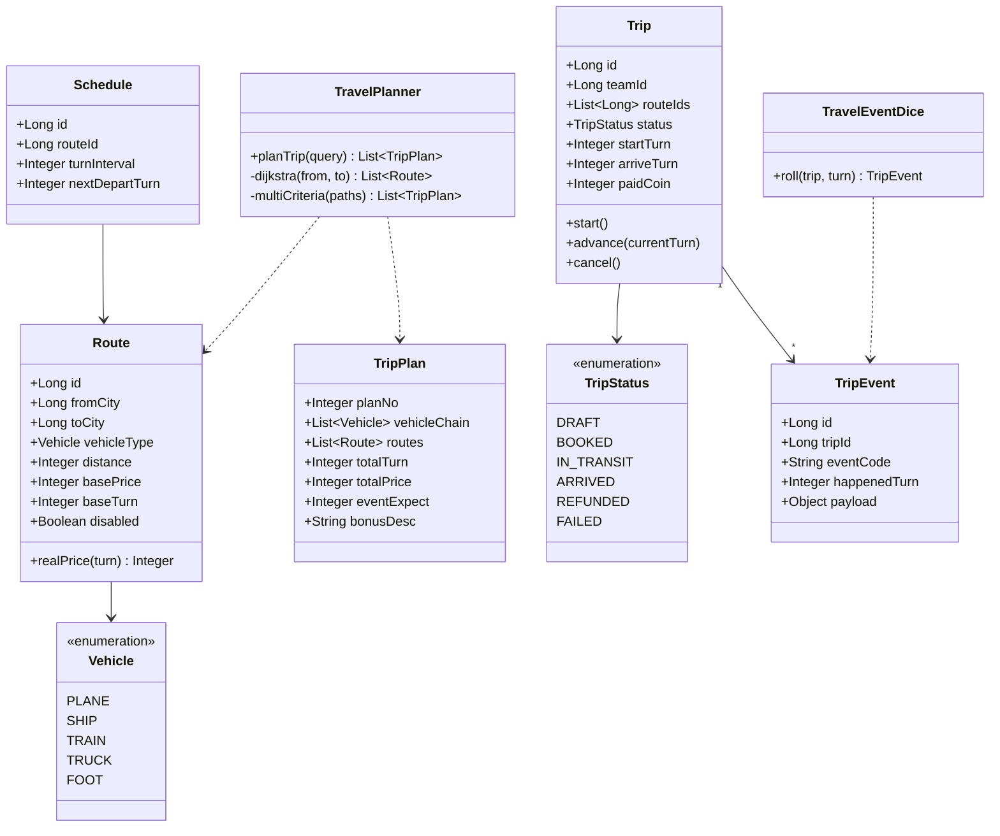
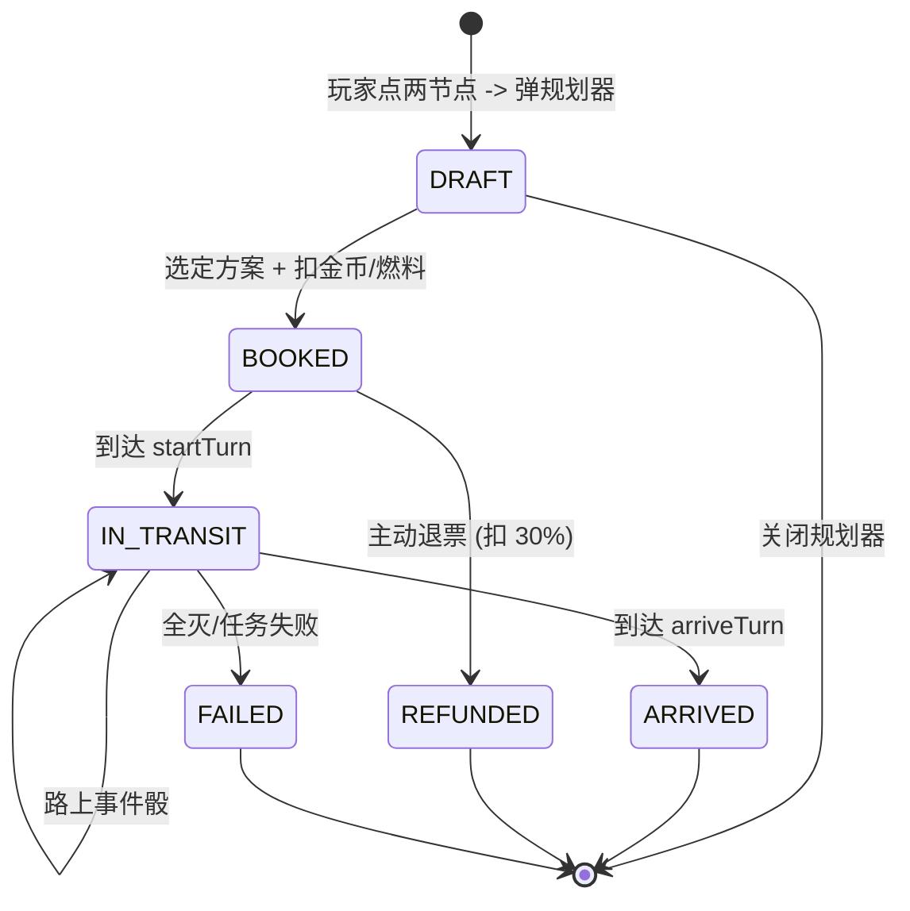
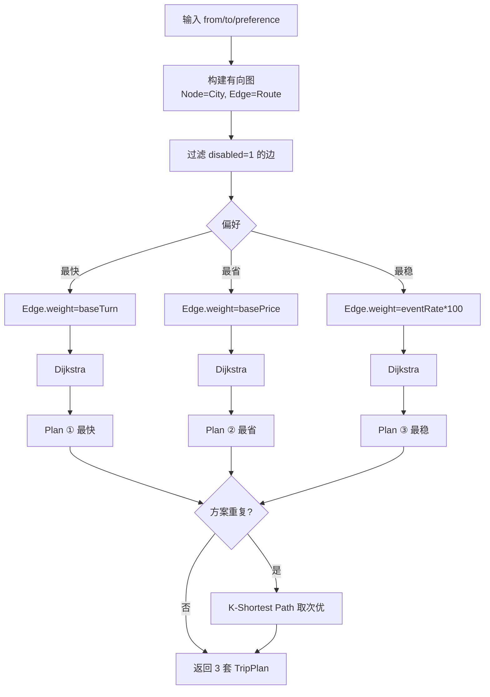
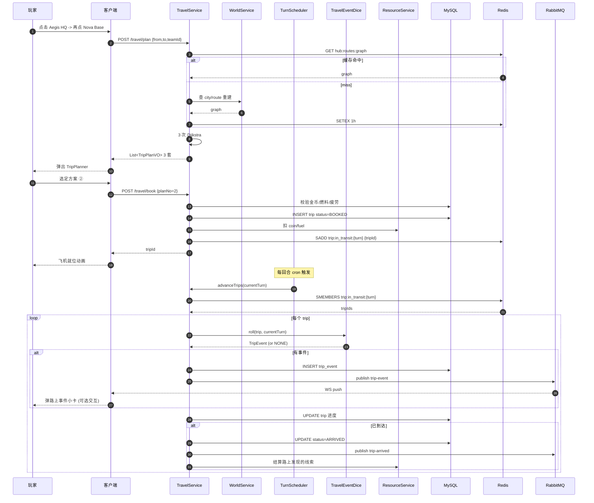
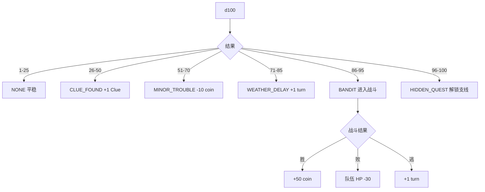
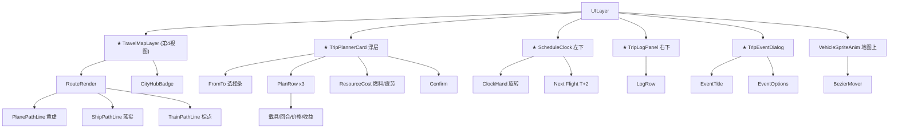

# S4 · 出行系统实现图 ★ (Travel System)

> **目标**：实现"打开规划器 → 路径算法 → 3 套方案 → 订票 → 在途事件 → 抵达"完整闭环。  
> **周期**：3 周（最长）。  
> **依赖**：S1（地图）、S2（队伍）、S3（任务可挂行程）。  
> **本 Sprint 是叠加"出行元素"的核心交付。**

---

## 1. 类图 (Class Diagram)



---

## 2. 行程完整生命周期



---

## 3. 表结构 (DDL)

```sql
-- 路径
CREATE TABLE route (
  id              BIGINT PRIMARY KEY AUTO_INCREMENT,
  from_city       BIGINT NOT NULL,
  to_city         BIGINT NOT NULL,
  vehicle_type    TINYINT NOT NULL COMMENT '1-Plane 2-Ship 3-Train 4-Truck 5-Foot',
  distance        INT NOT NULL,
  base_price      INT NOT NULL,
  base_turn       INT NOT NULL,
  disabled        TINYINT DEFAULT 0,
  INDEX idx_from (from_city),
  INDEX idx_to (to_city)
) COMMENT='路径';

-- 班次
CREATE TABLE schedule (
  id              BIGINT PRIMARY KEY AUTO_INCREMENT,
  route_id        BIGINT NOT NULL,
  turn_interval   INT DEFAULT 3 COMMENT '班次周期',
  next_depart_turn INT NOT NULL,
  UNIQUE KEY uk_route (route_id)
) COMMENT='班次';

-- 行程
CREATE TABLE trip (
  id              BIGINT PRIMARY KEY AUTO_INCREMENT,
  team_id         BIGINT NOT NULL,
  player_id       BIGINT NOT NULL,
  mission_id      BIGINT COMMENT '关联任务 (可空)',
  route_ids       VARCHAR(512) COMMENT 'JSON, 多段拼接',
  status          VARCHAR(16) NOT NULL DEFAULT 'DRAFT',
  start_turn      INT,
  arrive_turn     INT,
  paid_coin       INT,
  paid_fuel       INT,
  INDEX idx_player (player_id),
  INDEX idx_status (status)
) COMMENT='行程';

-- 路上事件
CREATE TABLE trip_event (
  id              BIGINT PRIMARY KEY AUTO_INCREMENT,
  trip_id         BIGINT NOT NULL,
  event_code      VARCHAR(32) NOT NULL,
  happened_turn   INT NOT NULL,
  payload         JSON,
  created_at      DATETIME DEFAULT CURRENT_TIMESTAMP,
  INDEX idx_trip (trip_id)
) COMMENT='路上事件';
```

---

## 4. 核心算法：Dijkstra 多式联运 + 多目标方案

### 4.1 算法流程



### 4.2 伪代码

```text
function planTrip(from, to, preference):
    graph = buildGraph(filter disabled)
    plans = []
    for w in [TURN, PRICE, RISK]:
        path = dijkstra(graph, from, to, weightFn=w)
        plans.add(toTripPlan(path))
    if plans.distinct().size < 3:
        plans = ksp(graph, from, to, k=3)
    return plans.sortBy(planNo)
```

### 4.3 复杂度

- N=100 城市 / M=400 路径
- 单次 Dijkstra: O((N+M)logN) ≈ 数毫秒
- 全图 Hub-Hub 最短路在启动时**预计算缓存到 Redis**

---

## 5. 关键时序：「打开规划器 → 订票 → 路上事件 → 抵达」



---

## 6. 路上事件骰逻辑



> 概率系数全部走 `Configuration.TRIP_EVENT_RATE_*`，可热刷新。

---

## 7. 接口契约 (OpenAPI 摘要)

```yaml
paths:
  /travel/plan:
    post:
      summary: 计算 3 套行程方案
      requestBody:
        content:
          application/json:
            schema: { $ref: '#/components/schemas/TripPlanQuery' }
      responses:
        '200':
          content:
            application/json:
              schema:
                type: array
                items: { $ref: '#/components/schemas/TripPlanVO' }

  /travel/book:
    post:
      summary: 订票创建 Trip
      requestBody:
        content:
          application/json:
            schema: { $ref: '#/components/schemas/TripBookQuery' }
      responses:
        '200':
          content:
            application/json:
              schema: { $ref: '#/components/schemas/TripVO' }

  /travel/trip/{tripId}/cancel:
    post:
      summary: 退票 (扣 30% 手续费)
      responses:
        '200':
          content:
            application/json:
              schema: { $ref: '#/components/schemas/TripRefundVO' }

  /travel/in-transit:
    post:
      summary: 我当前在途行程
      requestBody:
        content:
          application/json:
            schema: { $ref: '#/components/schemas/TripInTransitQuery' }
      responses:
        '200':
          content:
            application/json:
              schema:
                type: array
                items: { $ref: '#/components/schemas/TripVO' }

  /travel/schedule:
    post:
      summary: 查路线班次
      requestBody:
        content:
          application/json:
            schema: { $ref: '#/components/schemas/ScheduleQuery' }
      responses:
        '200':
          content:
            application/json:
              schema:
                type: array
                items: { $ref: '#/components/schemas/ScheduleVO' }

components:
  schemas:
    TripPlanQuery:
      type: object
      required: [fromCityId, toCityId, teamId]
      properties:
        fromCityId: { type: integer, format: int64 }
        toCityId: { type: integer, format: int64 }
        teamId: { type: integer, format: int64 }
        preference: { type: integer, enum: [1, 2, 3], description: '1快 2省 3稳' }
    TripPlanVO:
      type: object
      properties:
        planNo: { type: integer }
        vehicleChain:
          type: array
          items: { type: string }
        totalTurn: { type: integer }
        totalPrice: { type: integer }
        eventExpect: { type: integer }
        bonusDesc: { type: string }
    TripBookQuery:
      type: object
      required: [planNo, fromCityId, toCityId, teamId]
      properties:
        planNo: { type: integer }
        fromCityId: { type: integer, format: int64 }
        toCityId: { type: integer, format: int64 }
        teamId: { type: integer, format: int64 }
        missionId: { type: integer, format: int64 }
    TripVO:
      type: object
      properties:
        id: { type: integer, format: int64 }
        teamId: { type: integer, format: int64 }
        status: { type: string }
        startTurn: { type: integer }
        arriveTurn: { type: integer }
        progressPercent: { type: integer }
    TripRefundVO:
      type: object
      properties:
        refundCoin: { type: integer }
        feeCoin: { type: integer }
    TripInTransitQuery:
      type: object
      properties:
        playerId: { type: integer, format: int64 }
    ScheduleQuery:
      type: object
      properties:
        routeIds:
          type: array
          items: { type: integer, format: int64 }
    ScheduleVO:
      type: object
      properties:
        routeId: { type: integer, format: int64 }
        nextDepartTurn: { type: integer }
        turnInterval: { type: integer }
```

---

## 8. 前端组件树（出行专属）



---

## 9. 性能优化

| 项 | 优化 |
|----|------|
| 路径预计算 | 启动时计算所有 Hub-Hub 最短路, Redis Hash 缓存 |
| 在途集合 | Redis Set `trip:in_transit:{turn}`, 避免每次扫表 |
| 班次查询 | `multiGet` 批量取多 routeId |
| WS 推送 | 路上事件按玩家 channel 推, 不广播 |
| 客户端动画 | `BezierMover` 用单 update 帧驱动, 减 GC |

---

## 10. 单测清单

### 后端

| 编号 | 用例 | 期望 |
|------|------|------|
| TR-T01 | `planTrip` 同城同节点 | 抛 BIZ_TRIP_SAME_CITY |
| TR-T02 | `planTrip` 不可达 | 抛 BIZ_TRIP_UNREACHABLE |
| TR-T03 | `planTrip` 3 套方案均不重复 | OK |
| TR-T04 | `planTrip` 偏好"快"-> totalTurn 最小 | OK |
| TR-T05 | `bookTrip` 余额不足 | 抛 BIZ_NOT_ENOUGH_COIN, 不创建 |
| TR-T06 | `bookTrip` 成功 -> 事务 commit | 资源扣减 + trip insert 同时成功 |
| TR-T07 | `cancelTrip` 在途不可退 | 抛 BIZ_TRIP_IN_TRANSIT |
| TR-T08 | `cancelTrip` BOOKED 退 70% | OK |
| TR-T09 | `advanceTrips` 到达终点 -> ARRIVED | OK |
| TR-T10 | `advanceTrips` 触发风暴事件 -> +1 turn | OK |
| TR-T11 | `Dice.roll` 1000 次 -> 概率分布吻合 ±5% | OK |

### 前端

| 编号 | 用例 | 期望 |
|------|------|------|
| FE-T31 | 点两节点 -> 自动弹 Planner | OK |
| FE-T32 | Hover 方案行 -> 地图预览路径高亮 | OK |
| FE-T33 | 余额不足 -> Confirm 灰色 | OK |
| FE-T34 | 收到 trip-event 推送 -> 弹小卡 | OK |
| FE-T35 | 飞机沿贝塞尔曲线动画 60fps | 帧率达标 |

---

## 11. 验收 Demo

```text
1. 切到 Travel Map -> 整张图变暗, 黄/蓝/棕三色航线点亮
2. 点 Aegis HQ -> 再点 Nova Base -> 弹规划器
3. 看到 3 套方案, 每套 hover 时地图对应路径闪烁
4. 选 ② -> 资源扣减动画 + 飞机/船图标在起点就位
5. 点 "End Turn" 推进 1 回合 -> 飞机沿曲线动到中点
6. 第 2 回合 -> 弹 "海上风暴, 延迟 1 回合" 事件
7. 第 4 回合 -> 抵达, Trip Log 加新行, 关联任务进度 +50%
8. 班次时钟同步显示 "Next Flight T+2"
```

---

## 12. 与 Java 规范对齐

- [x] `TripPlanQuery / TripBookQuery / TripInTransitQuery / ScheduleQuery` 全部实体接收
- [x] `TripPlanVO / TripVO / TripRefundVO / ScheduleVO` 返回带 Swagger
- [x] `bookTrip` `@Transactional` 保证扣资源+创建行程原子
- [x] `Configuration` 集中管理 `TRIP_EVENT_RATE_*`, `PLANE_PRICE_FACTOR`, `REFUND_FEE_RATE` 等
- [x] Redis `multiGet` 批量取班次/路径
- [x] `@Slf4j` 关键节点: 订票/在途事件/到达
- [x] 异常 catch 必须打 `log.error("Trip {} 路上结算异常:", tripId, e)`
- [x] `if/for` 强制大括号
