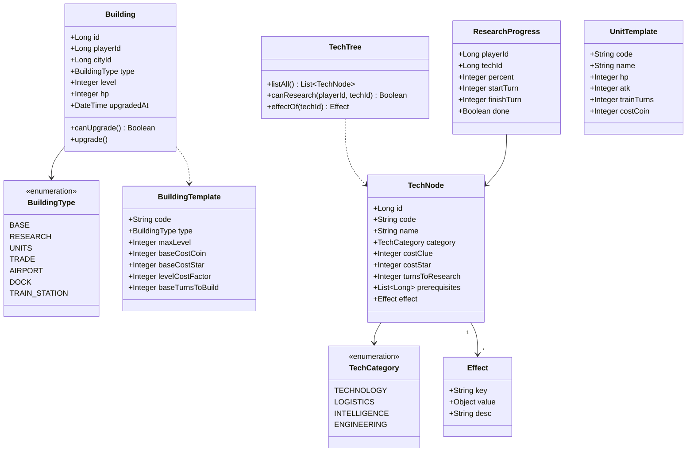
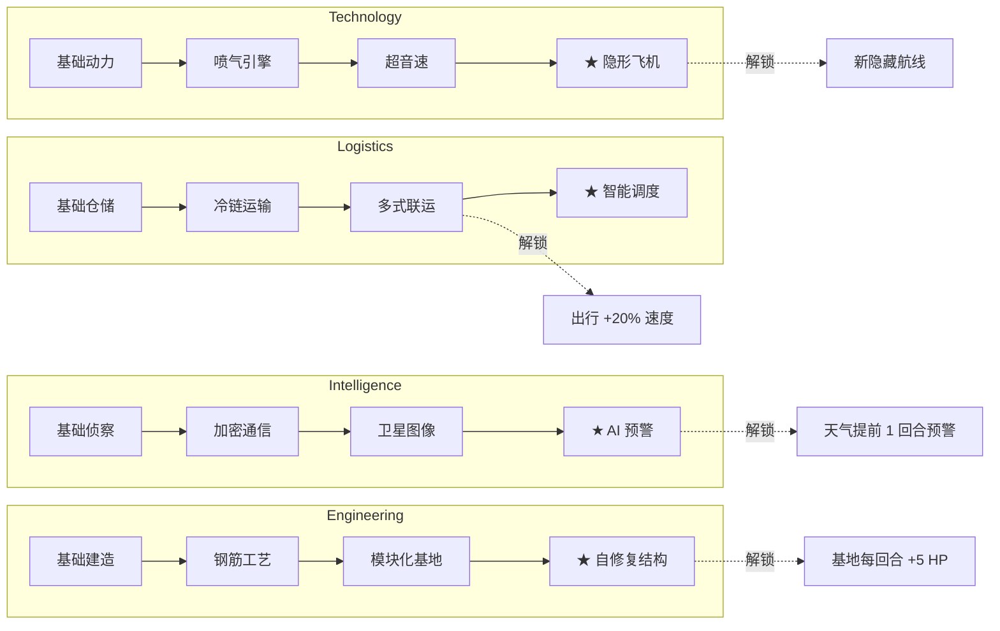
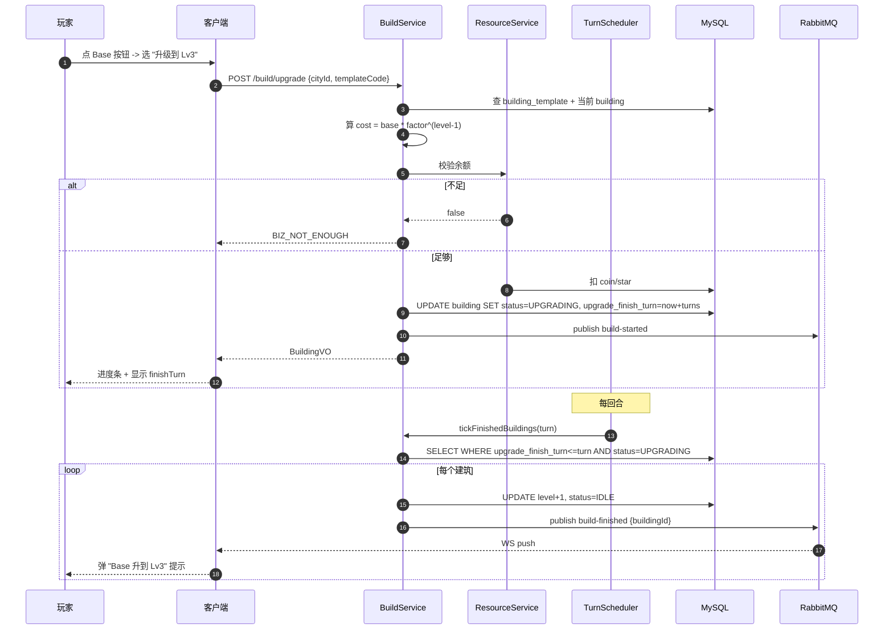
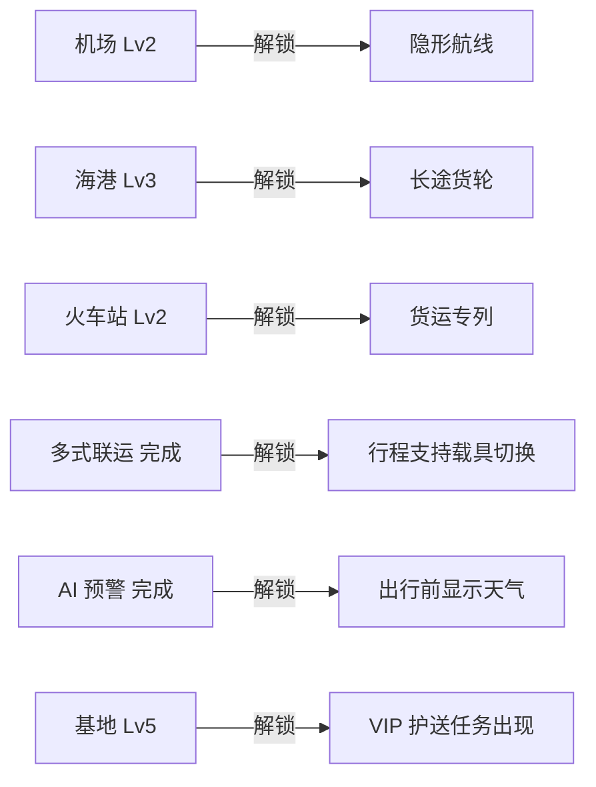
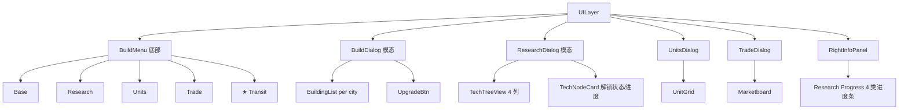

# S5 · 建造/研究实现图 (Build & Research)

> **目标**：玩家在基地里能升级建筑、解锁科技、招募兵种、扩展贸易站。  
> **周期**：2 周。  
> **依赖**：S2（玩家资源）、S4（出行解锁与建筑挂钩）。

---

## 1. 类图 (Class Diagram)



---

## 2. 表结构 (DDL)

```sql
-- 建筑模板
CREATE TABLE building_template (
  id              BIGINT PRIMARY KEY AUTO_INCREMENT,
  code            VARCHAR(64) UNIQUE NOT NULL,
  type            VARCHAR(16) NOT NULL,
  max_level       INT DEFAULT 5,
  base_cost_coin  INT,
  base_cost_star  INT,
  level_cost_factor DECIMAL(4,2) DEFAULT 1.50,
  base_turns_build INT DEFAULT 2
) COMMENT='建筑模板';

-- 玩家持有的建筑
CREATE TABLE building (
  id              BIGINT PRIMARY KEY AUTO_INCREMENT,
  player_id       BIGINT NOT NULL,
  city_id         BIGINT NOT NULL,
  template_id     BIGINT NOT NULL,
  level           INT DEFAULT 1,
  hp              INT DEFAULT 100,
  upgrade_finish_turn INT,
  status          VARCHAR(16) DEFAULT 'IDLE' COMMENT 'IDLE/UPGRADING',
  INDEX idx_player_city (player_id, city_id)
) COMMENT='玩家建筑';

-- 科技节点
CREATE TABLE tech_node (
  id              BIGINT PRIMARY KEY AUTO_INCREMENT,
  code            VARCHAR(64) UNIQUE NOT NULL,
  name            VARCHAR(64) NOT NULL,
  category        VARCHAR(16) NOT NULL,
  cost_clue       INT,
  cost_star       INT,
  turns_research  INT DEFAULT 5,
  prerequisites   VARCHAR(255) COMMENT 'JSON 数组, 前置 tech_id',
  effect_json     JSON
) COMMENT='科技节点';

-- 玩家研究进度
CREATE TABLE research_progress (
  id              BIGINT PRIMARY KEY AUTO_INCREMENT,
  player_id       BIGINT NOT NULL,
  tech_id         BIGINT NOT NULL,
  percent         INT DEFAULT 0,
  start_turn      INT,
  finish_turn     INT,
  done            TINYINT DEFAULT 0,
  UNIQUE KEY uk_player_tech (player_id, tech_id)
) COMMENT='研究进度';

-- 兵种模板
CREATE TABLE unit_template (
  id              BIGINT PRIMARY KEY AUTO_INCREMENT,
  code            VARCHAR(64) UNIQUE NOT NULL,
  name            VARCHAR(64),
  hp              INT,
  atk             INT,
  train_turns     INT,
  cost_coin       INT,
  unlock_tech     BIGINT COMMENT '需研究的 tech_id'
) COMMENT='兵种模板';

-- 贸易站订单（Trade）
CREATE TABLE trade_order (
  id              BIGINT PRIMARY KEY AUTO_INCREMENT,
  player_id       BIGINT NOT NULL,
  city_id         BIGINT NOT NULL,
  give_resource   VARCHAR(16) COMMENT 'COIN/CLUE/STAR/FUEL',
  give_amount     INT,
  get_resource    VARCHAR(16),
  get_amount      INT,
  status          VARCHAR(16) DEFAULT 'OPEN'
) COMMENT='贸易订单';
```

---

## 3. 科技树（示例 4 大类 16 节点）



---

## 4. 接口契约 (OpenAPI 摘要)

```yaml
paths:
  /build/list:
    post:
      summary: 列出玩家在所有城市的建筑
      requestBody:
        content:
          application/json:
            schema: { $ref: '#/components/schemas/BuildListQuery' }
      responses:
        '200':
          content:
            application/json:
              schema:
                type: array
                items: { $ref: '#/components/schemas/BuildingVO' }

  /build/upgrade:
    post:
      summary: 升级/新建建筑
      requestBody:
        content:
          application/json:
            schema: { $ref: '#/components/schemas/BuildUpgradeQuery' }
      responses:
        '200':
          content:
            application/json:
              schema: { $ref: '#/components/schemas/BuildingVO' }

  /research/tree:
    post:
      summary: 拉科技树 + 我当前进度
      requestBody:
        content:
          application/json:
            schema: { $ref: '#/components/schemas/ResearchTreeQuery' }
      responses:
        '200':
          content:
            application/json:
              schema: { $ref: '#/components/schemas/ResearchTreeVO' }

  /research/start:
    post:
      summary: 启动一项研究
      requestBody:
        content:
          application/json:
            schema: { $ref: '#/components/schemas/ResearchStartQuery' }
      responses:
        '200':
          content:
            application/json:
              schema: { $ref: '#/components/schemas/ResearchProgressVO' }

  /units/train:
    post:
      summary: 招募兵种
      requestBody:
        content:
          application/json:
            schema: { $ref: '#/components/schemas/UnitTrainQuery' }
      responses:
        '200':
          content:
            application/json:
              schema: { $ref: '#/components/schemas/UnitTrainVO' }

  /trade/post:
    post:
      summary: 挂单
      requestBody:
        content:
          application/json:
            schema: { $ref: '#/components/schemas/TradePostQuery' }
      responses:
        '200':
          content:
            application/json:
              schema: { $ref: '#/components/schemas/TradeOrderVO' }

components:
  schemas:
    BuildListQuery:
      type: object
      properties:
        playerId: { type: integer, format: int64 }
        cityId: { type: integer, format: int64 }
    BuildUpgradeQuery:
      type: object
      required: [playerId, cityId, templateCode]
      properties:
        playerId: { type: integer, format: int64 }
        cityId: { type: integer, format: int64 }
        templateCode: { type: string }
    BuildingVO:
      type: object
      properties:
        id: { type: integer, format: int64 }
        cityId: { type: integer, format: int64 }
        type: { type: string }
        level: { type: integer }
        upgradeFinishTurn: { type: integer }
        status: { type: string }
    ResearchTreeQuery:
      type: object
      properties:
        playerId: { type: integer, format: int64 }
    ResearchTreeVO:
      type: object
      properties:
        nodes:
          type: array
          items: { $ref: '#/components/schemas/TechNodeVO' }
        progressOf:
          type: object
          additionalProperties: { type: integer }
    TechNodeVO:
      type: object
      properties:
        id: { type: integer, format: int64 }
        code: { type: string }
        name: { type: string }
        category: { type: string }
        prerequisites:
          type: array
          items: { type: integer, format: int64 }
        effectDesc: { type: string }
    ResearchStartQuery:
      type: object
      required: [playerId, techId]
      properties:
        playerId: { type: integer, format: int64 }
        techId: { type: integer, format: int64 }
    ResearchProgressVO:
      type: object
      properties:
        techId: { type: integer, format: int64 }
        percent: { type: integer }
        finishTurn: { type: integer }
    UnitTrainQuery:
      type: object
      required: [playerId, cityId, unitCode]
      properties:
        playerId: { type: integer, format: int64 }
        cityId: { type: integer, format: int64 }
        unitCode: { type: string }
    UnitTrainVO:
      type: object
      properties:
        unitCode: { type: string }
        finishTurn: { type: integer }
    TradePostQuery:
      type: object
      required: [playerId, cityId, give, get]
      properties:
        playerId: { type: integer, format: int64 }
        cityId: { type: integer, format: int64 }
        give: { $ref: '#/components/schemas/ResourcePair' }
        get: { $ref: '#/components/schemas/ResourcePair' }
    ResourcePair:
      type: object
      properties:
        resource: { type: string, enum: [COIN, CLUE, STAR, FUEL] }
        amount: { type: integer }
    TradeOrderVO:
      type: object
      properties:
        id: { type: integer, format: int64 }
        status: { type: string }
```

---

## 5. 关键时序：「升级建筑」



---

## 6. 解锁规则（建造 ↔ 出行 ↔ 任务）



---

## 7. 前端组件树



---

## 8. 单测清单

### 后端

| 编号 | 用例 | 期望 |
|------|------|------|
| BD-T01 | `BuildService.upgrade` 已达 maxLevel | BIZ_BUILDING_MAX |
| BD-T02 | `BuildService.upgrade` 余额不足 | BIZ_NOT_ENOUGH |
| BD-T03 | `BuildService.upgrade` 正在升级 | BIZ_BUILDING_BUSY |
| BD-T04 | 升级完成 -> level+1 | OK |
| RS-T01 | `Research.start` 前置未完成 | BIZ_TECH_PREREQ |
| RS-T02 | `Research.start` 重复研究 | BIZ_TECH_DONE |
| RS-T03 | 研究完成 -> Effect 应用到玩家 | 速度+20% |
| TR-T01 | `trade.post` 同资源换同资源 | BIZ_TRADE_INVALID |

### 前端

| 编号 | 用例 | 期望 |
|------|------|------|
| FE-T41 | TechTree 节点未解锁 -> 灰色不可点 | OK |
| FE-T42 | 升级完成推送 -> 提示 + 进度条满 | OK |
| FE-T43 | TechTree 缩放/拖拽 | 流畅 |

---

## 9. 验收 Demo

```text
1. 点 Base -> 弹建筑列表 -> 选 Aegis Base 升 Lv2 -> 扣 200 coin, 进度条 2 回合
2. 推进 2 回合 -> 弹 "Aegis Base Lv2!" + 解锁 Lv3 招募
3. 点 Research -> 看到 4 列科技树, "多式联运" 节点可点
4. 启动研究 -> 进度条占位, 5 回合后完成, 出行界面提示 "速度 +20%"
5. 点 Units -> 招募 1 个 Scout, 3 回合后入队
6. 点 Trade -> 挂单 100 coin -> 50 fuel, 等买家成交
```

---

## 10. 与 Java 规范对齐

- [x] 全 `XxxQuery / XxxVO`, 无 Map
- [x] 升级/研究/招募 走 `@Transactional`
- [x] `Configuration` 管理: `BUILDING_FACTOR_DEFAULT`, `RESEARCH_TURN_FACTOR`
- [x] Effect 使用强类型而非 Map
- [x] `@Slf4j` 升级/完成/失败均日志
- [x] Redis 缓存科技树, 节点变更时 evict
