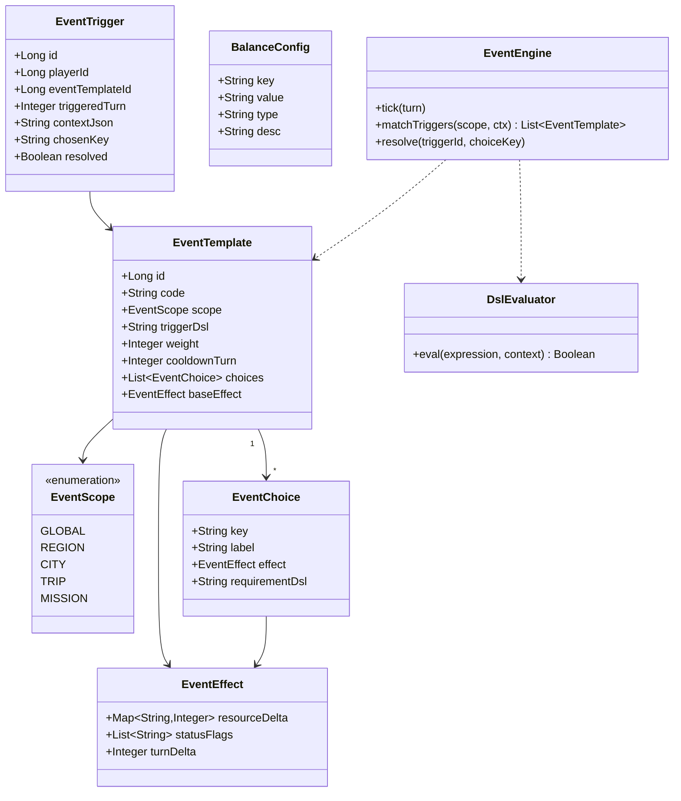
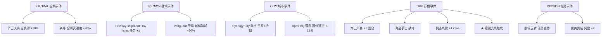
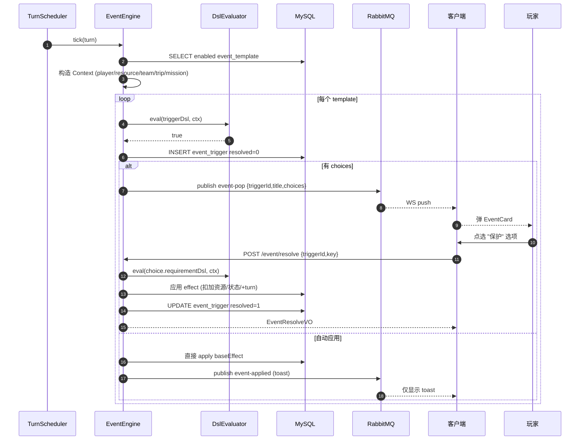
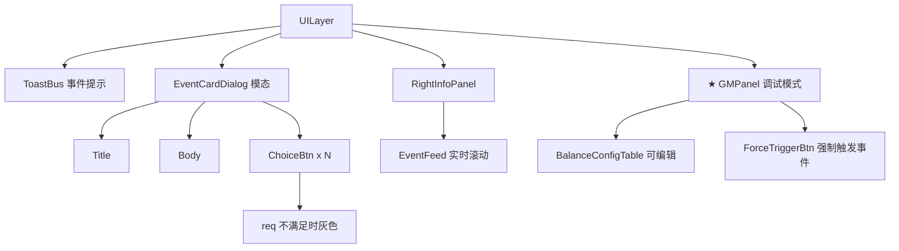
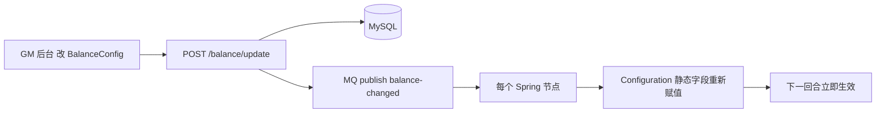

# S6 · 事件 / 平衡实现图 (Event & Balance)

> **目标**：把"事件"作为横切系统贯穿全游戏（地图、出行、任务）；建立可热刷新的数值平衡表。  
> **周期**：2 周。  
> **依赖**：S1~S5 全部模块。

---

## 1. 类图 (Class Diagram)



---

## 2. 事件触发 DSL（轻量表达式）

```text
trigger 表达式语法（举例）:

  player.level >= 3 AND region.name == "Toy Isles"
  trip.vehicle == "PLANE" AND turn % 5 == 0
  mission.type == "TRAVEL_VIP" AND building["BASE"].level >= 2
  resource.coin > 1000 AND random(100) < 25

requirement 表达式（选项可选条件）:

  team.has(class="MEDIC")
  resource.fuel >= 20

effect (DSL 也可用 JSON):
  {
    "resourceDelta": {"COIN": -50, "CLUE": +1},
    "statusFlags": ["INSPIRED"],
    "turnDelta": 0
  }
```

> 用 [Aviator](https://github.com/killme2008/aviatorscript) 或 SpEL 做表达式引擎，避免重新造轮子。  
> Configuration 注入 `Configuration.EVENT_DSL_ENGINE = aviator`。

---

## 3. 表结构 (DDL)

```sql
-- 事件模板（GM 配置）
CREATE TABLE event_template (
  id              BIGINT PRIMARY KEY AUTO_INCREMENT,
  code            VARCHAR(64) UNIQUE NOT NULL,
  scope           VARCHAR(16) NOT NULL,
  trigger_dsl     TEXT NOT NULL,
  weight          INT DEFAULT 100,
  cooldown_turn   INT DEFAULT 5,
  base_effect     JSON,
  choices_json    JSON COMMENT '[{key,label,effect,reqDsl}]',
  enabled         TINYINT DEFAULT 1
) COMMENT='事件模板';

-- 触发流水
CREATE TABLE event_trigger (
  id              BIGINT PRIMARY KEY AUTO_INCREMENT,
  player_id       BIGINT NOT NULL,
  event_template_id BIGINT NOT NULL,
  triggered_turn  INT NOT NULL,
  scope           VARCHAR(16),
  context_json    JSON,
  chosen_key      VARCHAR(32),
  resolved        TINYINT DEFAULT 0,
  resolved_turn   INT,
  INDEX idx_player_turn (player_id, triggered_turn)
) COMMENT='事件触发记录';

-- 平衡配置（key-value, 热刷新）
CREATE TABLE balance_config (
  cfg_key         VARCHAR(64) PRIMARY KEY,
  cfg_value       VARCHAR(255) NOT NULL,
  cfg_type        VARCHAR(16) COMMENT 'INT/DOUBLE/STR/JSON',
  description     VARCHAR(255),
  updated_at      DATETIME DEFAULT CURRENT_TIMESTAMP
) COMMENT='平衡配置';
```

---

## 4. 事件触发整体流程

```mermaid
flowchart TB
    Tick["每回合 TurnScheduler.tick()"] --> Loop[for each player]
    Loop --> Build[构建 Context<br/>player+resource+team+activeTrips+activeMissions]
    Build --> Match[EventEngine.matchTriggers(scope=GLOBAL/REGION/...)]
    Match --> Filter[过滤 cooldown 内 + enabled=1]
    Filter --> Weight[按 weight 加权随机抽取 0-2 个]
    Weight --> Eval[DslEvaluator.eval(triggerDsl, ctx)]
    Eval -- false --> Skip
    Eval -- true --> Insert[INSERT event_trigger resolved=0]
    Insert --> Side{有 choices?}
    Side -- 否 --> AutoApply[直接应用 baseEffect]
    Side -- 是 --> Push[MQ 推 WS 客户端弹窗]
    Push --> Wait[等玩家选 choiceKey]
    Wait --> Resolve[POST /event/resolve]
    Resolve --> ApplyEffect[apply effect.resourceDelta]
    Resolve --> Mark[UPDATE event_trigger resolved=1]
    AutoApply --> Mark
```

---

## 5. 事件作用域示例



---

## 6. 接口契约 (OpenAPI 摘要)

```yaml
paths:
  /event/pull:
    post:
      summary: 拉当前未解决的事件
      requestBody:
        content:
          application/json:
            schema: { $ref: '#/components/schemas/EventPullQuery' }
      responses:
        '200':
          content:
            application/json:
              schema:
                type: array
                items: { $ref: '#/components/schemas/EventCardVO' }

  /event/resolve:
    post:
      summary: 选择事件分支
      requestBody:
        content:
          application/json:
            schema: { $ref: '#/components/schemas/EventResolveQuery' }
      responses:
        '200':
          content:
            application/json:
              schema: { $ref: '#/components/schemas/EventResolveVO' }

  /balance/list:
    post:
      summary: 列出全部平衡参数（仅 GM）
      responses:
        '200':
          content:
            application/json:
              schema:
                type: array
                items: { $ref: '#/components/schemas/BalanceConfigVO' }

  /balance/update:
    post:
      summary: 修改单条平衡参数（仅 GM, 热刷新）
      requestBody:
        content:
          application/json:
            schema: { $ref: '#/components/schemas/BalanceUpdateQuery' }
      responses:
        '200':
          content:
            application/json:
              schema: { $ref: '#/components/schemas/BalanceConfigVO' }

components:
  schemas:
    EventPullQuery:
      type: object
      properties:
        playerId: { type: integer, format: int64 }
    EventCardVO:
      type: object
      properties:
        triggerId: { type: integer, format: int64 }
        title: { type: string }
        scope: { type: string }
        description: { type: string }
        choices:
          type: array
          items: { $ref: '#/components/schemas/EventChoiceVO' }
    EventChoiceVO:
      type: object
      properties:
        key: { type: string }
        label: { type: string }
        previewEffect: { type: string }
        available: { type: boolean }
    EventResolveQuery:
      type: object
      required: [triggerId, choiceKey]
      properties:
        triggerId: { type: integer, format: int64 }
        choiceKey: { type: string }
    EventResolveVO:
      type: object
      properties:
        applied: { type: boolean }
        resourceDeltaText: { type: string }
        nextEventTriggered: { type: boolean }
    BalanceConfigVO:
      type: object
      properties:
        cfgKey: { type: string }
        cfgValue: { type: string }
        cfgType: { type: string }
        description: { type: string }
    BalanceUpdateQuery:
      type: object
      required: [cfgKey, cfgValue]
      properties:
        cfgKey: { type: string }
        cfgValue: { type: string }
```

---

## 7. 数值平衡表（核心 30 项）

| key | 默认 | 描述 | 影响模块 |
|-----|------|------|----------|
| `RESOURCE_INIT_COIN` | 5000 | 新档初始金币 | S2 |
| `RESOURCE_INIT_FUEL` | 200 | 新档初始燃料 | S4 |
| `TURN_LENGTH_SECONDS` | 0 | 0=手动推进 | S1 |
| `MISSION_POOL_SIZE` | 5 | 任务池上限 | S3 |
| `MISSION_REFRESH_TURN` | 1 | 任务刷新间隔 | S3 |
| `TRIP_EVENT_RATE_NONE` | 0.25 | 无事件概率 | S4 |
| `TRIP_EVENT_RATE_CLUE` | 0.25 | 偶遇线索概率 | S4 |
| `TRIP_EVENT_RATE_TROUBLE` | 0.20 | 小麻烦概率 | S4 |
| `TRIP_EVENT_RATE_WEATHER` | 0.15 | 天气延迟概率 | S4 |
| `TRIP_EVENT_RATE_BANDIT` | 0.10 | 海盗概率 | S4 |
| `TRIP_EVENT_RATE_HIDDEN` | 0.05 | 隐藏支线概率 | S4 |
| `PLANE_PRICE_FACTOR` | 1.5 | 飞机基础价系数 | S4 |
| `SHIP_PRICE_FACTOR` | 0.8 | 轮船基础价系数 | S4 |
| `TRAIN_PRICE_FACTOR` | 1.0 | 火车基础价系数 | S4 |
| `REFUND_FEE_RATE` | 0.30 | 退票手续费比例 | S4 |
| `PEAK_PRICE_RATE` | 1.30 | 旺季加价 | S4 |
| `EARLY_BOOK_DISCOUNT` | 0.80 | 提前预订折扣 | S4 |
| `BUILDING_FACTOR_DEFAULT` | 1.50 | 升级费用倍率 | S5 |
| `RESEARCH_TURN_FACTOR` | 1.00 | 研究耗时倍率 | S5 |
| `TEAM_MAX_SIZE` | 5 | 队伍最大人数 | S2 |
| `AGENT_FATIGUE_PER_TURN` | 5 | 在途疲劳/回合 | S2/S4 |
| `AGENT_REST_PER_TURN` | 10 | 城市休息恢复 | S2 |
| `EVENT_GLOBAL_RATE` | 0.10 | 全局事件每回合触发率 | S6 |
| `EVENT_REGION_RATE` | 0.20 | 区域事件触发率 | S6 |
| `EVENT_TRIP_RATE` | 0.25 | 行程事件触发率 | S6 |
| `EVENT_COOLDOWN_DEFAULT` | 5 | 事件默认冷却 | S6 |
| `LOG_RETENTION_DAYS` | 30 | 日志保留天数 | All |
| `WS_PUSH_BATCH_SIZE` | 50 | WS 推送批量大小 | All |
| `REDIS_TTL_TEAM_STATS` | 60 | 队伍属性缓存 TTL | S2 |
| `REDIS_TTL_TECH_TREE` | 3600 | 科技树缓存 TTL | S5 |

> 上线后 GM 在后台直接调，无需重启。

---

## 8. 关键时序：「事件触发 → 玩家选项 → 应用」



---

## 9. 前端组件树



---

## 10. 平衡热刷新架构



---

## 11. 单测清单

### 后端

| 编号 | 用例 | 期望 |
|------|------|------|
| EV-T01 | DSL "player.level >= 3" 解析 | level=2 false / level=3 true |
| EV-T02 | EventEngine.tick 冷却内不再触发 | OK |
| EV-T03 | requirementDsl 不满足 -> 选项灰色 | OK |
| EV-T04 | 事件 effect resourceDelta 应用事务 | 失败回滚 |
| EV-T05 | 1 回合最多触发 N 个事件（配置） | 不超限 |
| BL-T01 | balance/update 修改 -> Configuration 静态字段更新 | OK |
| BL-T02 | balance/update 类型不匹配 (INT 给 abc) | BIZ_BALANCE_TYPE |
| BL-T03 | 跨节点 MQ 广播 -> 所有节点同步 | OK |

### 前端

| 编号 | 用例 | 期望 |
|------|------|------|
| FE-T51 | EventCard choice 不可用时灰色 + tooltip | OK |
| FE-T52 | EventFeed 5 秒后自动淡出 | OK |
| FE-T53 | GMPanel 编辑保存后 toast 成功 | OK |

---

## 12. 验收 Demo

```text
1. 推进 3 回合 -> 弹 "Toy Isles 玩具节, 选 [庆祝(+200 coin)] / [低调(+1 clue)]"
2. 选 [庆祝] -> 顶部金币数字滚动 +200, EventFeed 多一行 "庆典"
3. 出行途中 -> 弹 "海上风暴, 选 [硬闯(20% 受损)] / [绕道(+1 turn)]"
4. 进 GM 模式 -> 把 EVENT_TRIP_RATE 改 0.50 -> 下一行程事件明显变多
5. 查 event_trigger 表 -> 全部 resolved=1, 流水留痕便于回放
```

---

## 13. 与 Java 规范对齐

- [x] `EventPullQuery / EventResolveQuery / BalanceUpdateQuery` 实体接收
- [x] `EventCardVO / EventResolveVO / BalanceConfigVO` 返回带 Swagger
- [x] DSL 引擎用 Aviator 或 SpEL（社区方案）
- [x] `Configuration` 通过 `@RefreshScope` + MQ 广播热刷新
- [x] 事件 effect 应用走 `@Transactional` 防止资源/状态不一致
- [x] `@Slf4j` 触发/选择/应用 全链路日志
- [x] event_trigger 流水 30 天后归档（`Configuration.LOG_RETENTION_DAYS`）
